# USB 转串口芯片 CH340

手册 版本:3C <http://wch.cn>

# 1、概述

CH340 是一个 USB 总线的转接芯片,实现 USB 转串口或者 USB 转打印口。

在串口方式下,CH340 提供常用的 MODEM 联络信号,用于为计算机扩展异步串口,或者将普通的 串口设备直接升级到 USB 总线。有关 USB 转打印口的说明请参考手册(二)CH340DS2。

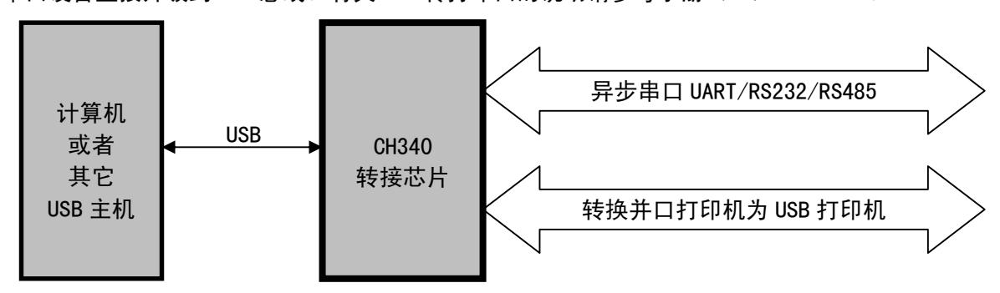

# 2、特点

- 全速 USB 设备接口,兼容 USB V2.0。
- 仿真标准串口,用于升级原串口外围设备,或者通过 USB 增加额外串口。
- 计算机端 Windows 操作系统下的串口应用程序完全兼容,无需修改。
- 硬件全双工串口,内置收发缓冲区,支持通讯波特率 50bps~2Mbps。
- 支持常用的 MODEM 联络信号 RTS、DTR、DCD、RI、DSR、CTS。
- 通过外加电平转换器件,提供 RS232、RS485、RS422 等接口。
- CH340R 芯片支持 IrDA 规范 SIR 红外线通讯,支持波特率 2400bps 到 115200bps。
- 内置固件,软件兼容 CH341,可以直接使用 CH341 的 VCP 驱动程序。
- 支持 5V 电源电压和 3.3V 电源电压。
- CH340C/N/K/E/X/B 内置时钟,无需外部晶振,CH340B 还内置 EEPROM 用于配置序列号等。
- 提供 SOP-16、SOP-8 和 SSOP-20 以及 ESSOP-10、MSOP-10 无铅封装,兼容 RoHS。

# 3、封装

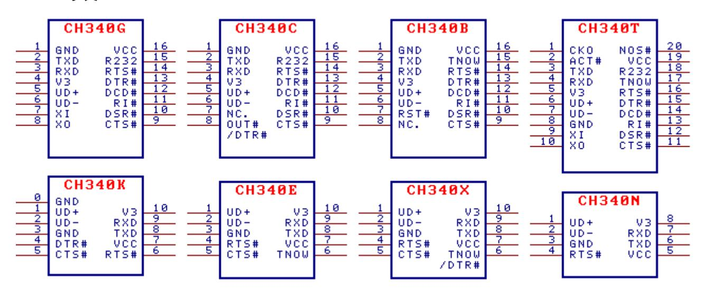

| 封装形式     | 塑体宽度  |        | 引脚间距            |         | 封装说明                | 订货型号   |
|----------|-------|--------|-----------------|---------|---------------------|--------|
| SOP-16   | 3.9mm | 150mil | 1.27mm 50mil |         | 标准的 16 脚贴片    | CH340G |
| SOP-16   | 3.9mm | 150mil | 1.27mm          | 50mil   | 标准的 16 脚贴片    | CH340C |
| SOP-16   | 3.9mm | 150mil | 1.27mm          | 50mil   | 标准的 16 脚贴片    | CH340B |
| SOP-8    | 3.9mm | 150mil | 1.27mm          | 50mil   | 标准的 8 脚贴片     | CH340N |
| ESSOP-10 | 3.9mm | 150mil | 1.00mm          | 39mil   | 带底板的窄距 10 脚贴片 | CH340K |
| MSOP-10  | 3.0mm | 118mil | 0.50mm          | 19.7mil | 微小型的 10 脚贴片   | CH340E |
| MSOP-10  | 3.0mm | 118mil | 0.50mm          | 19.7mil | 微小型的 10 脚贴片   | CH340X |
| SSOP-20  | 5.3mm | 209mil | 0.65mm          | 25mil   | 缩小型 20 脚贴片    | CH340T |
| SSOP-20  | 5.3mm | 209mil | 0.65mm          | 25mil   | 缩小型 20 脚贴片    | CH340R |

备注:CH340C、CH340N、CH340K、CH340E、CH340X 和 CH340B 内置时钟,无需外部晶振。

CH340B 内置 EEPROM 用于配置序列号,以及部分功能可定制等。如需小体积建议用 CH343P。

CH340K 内置三只二极管用于防止独立供电时 MCU 通过 I/O 引脚对 CH340 电流倒灌。

CH340K 的底板是 0#引脚 GND,是可选连接;3#引脚 GND 是必要连接。

CH340X 基于 CH340E 改进,增加了 3.3V 供电时的 IO 耐受 5V 特性。

CH340X 的 6#引脚如果外加电阻可以将 6#引脚从 TNOW 切换为 DTR#,两种配置详见 5.3 节。

CH340C 如果批号 4 开头且末 3 位大于 B40,则可为 8#引脚加 4.7KΩ 下拉电阻将其改为 DTR#。

CH340R 提供反极性 TXD 和 MODEM 信号,已停产。

CH340 的 USB 收发器按 USB2.0 全内置设计,UD+和 UD-引脚建议不要额外串接电阻。

# 4、引脚

| SSOP20 引脚号 | SOP16 引脚号 | ESSOP10 引脚号 | SOP8 引脚号 | 引脚 名称 | 类型        | 引脚说明 (括号中说明仅针对 CH340R 型号)                                               |                                                                       |  |
|---------------|--------------|----------------|-------------|----------|-----------|-------------------------------------------------------------------------------|-----------------------------------------------------------------------|--|
| 19            | 16           | 7              | 5           | VCC      | 电源        | 正电源输入端,需要外接 0.1uF 电源退耦电容                                                |                                                                       |  |
| 8             | 1            | 3、0            | 3           | GND      | 电源        | 公共接地端,直接连到 USB 总线的地线                                                    |                                                                       |  |
| 5             | 4            | 10             | 8           | V3       | 电源        | 在 3.3V 电源电压时连接 VCC 输入外部电源, 在 5V 电源电压时外接容量为 0.1uF 退耦电容 |                                                                       |  |
|               |              |                |             | XI       | 输入        | CH340T/R/G:晶体振荡的输入端, 需外接 12MHz 晶体及振荡电容                               |                                                                       |  |
| 9             | 7            | 无              | 无           | NC.      | 空脚        | CH340C:空脚,必须悬空                                                                |                                                                       |  |
|               |              |                |             | RST#     | 输入        | CH340B:外部复位输入, 低电平有效,内置上拉电阻                                                |                                                                       |  |
|               |              |                |             | XO       | 输出        | CH340T/R/G:晶体振荡的输出端, 需外接 12MHz 晶体及振荡电容                               |                                                                       |  |
| 10            | 8 无       |                | 无           |          | OUT#      | 输出                                                                            | CH340C:MODEM 通用输出信号,软件定义, 低有效。部分批次 CH340C 可选切换为第二 DTR# |  |
|               |              |                |             | NC.      | 空脚        | CH340B:空脚,必须悬空                                                                |                                                                       |  |
| 6             | 5            | 1              | 1           | UD+      | USB 信号 | 直接连到 USB 总线的 D+数据线,不要串联电阻                                            |                                                                       |  |
| 7             | 6            | 2              | 2           | UD-      | USB 信号 | 直接连到 USB 总线的 D-数据线,不要串联电阻                                            |                                                                       |  |
| 20            | 无            | 无              | 无           | NOS#     | 输入        | 禁止 USB 设备挂起,低电平有效,内置上拉电阻                                                |                                                                       |  |
| 3             | 2            | 8              | 6           | TXD      | 输出        | 串行数据输出(CH340R 型号为反相输出)                                                     |                                                                       |  |
| 4             | 3            | 9              | 7           | RXD      | 输入        | 串行数据输入,内置可控的上拉和下拉电阻                                                           |                                                                       |  |
| 11            | 9            | 5              | 无           | CTS#     | 输入        | MODEM 联络输入信号,清除发送,低(高)有效                                                   |                                                                       |  |
| 12            | 10           | 无              | 无           | DSR#     | 输入        | MODEM 联络输入信号,数据装置就绪,低(高)有效                                                 |                                                                       |  |
| 13            | 11           | 无              | 无           | RI#      | 输入        | MODEM 联络输入信号,振铃指示,低(高)有效                                                   |                                                                       |  |
| 14            | 12           | 无              | 无           | DCD#     | 输入        | MODEM 联络输入信号,载波检测,低(高)有效                                                   |                                                                       |  |

| 15       | 13 | 4 | 无      | DTR# | 输出                      | MODEM 联络输出信号,数据终端就绪,低(高)有效    |
|----------|----|---|--------|------|-------------------------|----------------------------------|
| 16       | 14 | 6 | 4      | RTS# | 输出                      | MODEM 联络输出信号,请求发送,低(高)有效      |
| 2        | 无  | 无 | 无      | ACT# | 输出                      | USB 配置完成状态输出,低电平有效            |
|          |    |   | 无      | R232 | 输入                      | CH340T/R/G/C:辅助 RS232 使能,  |
| 18 15 |    | 无 |        |      |                         | 高电平有效,内置下拉                       |
|          |    |   |        | TNOW | 输出                      | CH340T/E/X/B:串口发送正在进行的状态指示,      |
| 17 15 |    |   |        |      |                         | 高电平有效。CH340X 外加电阻可切换为 DTR# |
|          | 无  | 无 |        |      | CH340R:串口模式设定输入,内置上拉电阻, |                                  |
|          |    |   |        | IR#  | 输入                      | 低电平为 SIR 红外线串口,高电平为普通串口    |
|          |    |   | 无 无 | CKO  | 输出                      | CH340T:时钟输出                      |
| 1        | 无  |   |        | NC.  | 空脚                      | CH340R:空脚,必须悬空                   |

注:CH340 未用到的 I/O 引脚可以悬空,应用图以 CH340T 等举例,也适用于 CH340G/C/N/K/E/X/B 等。

# 5、功能说明

### 5.1. 时钟、复位、电源、连接

CH340G/CH340T/CH340R 芯片正常工作时需要外部向 XI 引脚提供 12MHz 的时钟信号。一般情况下, 时钟信号由 CH340 内置的反相器通过晶体稳频振荡产生。外围电路只需要在 XI 和 XO 引脚之间连接一 个 12MHz 的晶体,并且分别为 XI 和 XO 引脚对地连接振荡电容。

CH340C/N/K/E/X/B 芯片都已内置时钟发生器,无需外部晶体及电容。

CH340 芯片内置了电源上电复位电路。CH340B 芯片还提供了低电平有效的外部复位输入引脚。

CH340 芯片支持 5V 电源电压或者 3.3V 电源电压。当使用 5V 工作电压时,CH340 芯片的 VCC 引脚 输入外部 5V 电源,并且 V3 引脚应该外接容量为 0.1uF 的电源退耦电容。当使用 3.3V 工作电压时, CH340 芯片的 V3 引脚应该与 VCC 引脚相连接,同时输入外部的 3.3V 电源,并且与 CH340 芯片相连接 的其它电路的工作电压不能超过 3.3V。

CH340X 和批号 4 开头的 CH340C/N 的 IO 支持 5V 耐压,防向内电流倒灌。

CH340K 不仅防向内电流倒灌,并且降低了对外驱动能力,可减少 CH340 向外的电流倒灌。

CH340 芯片自动支持 USB 设备挂起以节约功耗,NOS#引脚为低电平时将禁止 USB 设备挂起。

CH340G/C/T/K 芯片的 DTR#引脚在 USB 配置完成之前作为配置输入引脚,可以外接 4.7KΩ的下拉 电阻在 USB 枚举期间产生默认的低电平,通过配置描述符向 USB 总线申请更大的电源电流。

CH340 芯片内置了 USB 上拉电阻,UD+和 UD-引脚应该直接连接到 USB 总线上。

异步串口方式下 CH340 芯片的引脚包括:数据传输引脚、MODEM 联络信号引脚、辅助引脚。

数据传输引脚包括:TXD 引脚和 RXD 引脚。串口输入空闲时,RXD 应为高电平。对于 CH340G/C/T/R 芯片,如果 R232 引脚为高电平启用辅助 RS232 功能,那么 RXD 引脚内部自动插入一个反相器,默认 为低电平。串口输出空闲时,CH340G/C/N/E/X/B/T 芯片的 TXD 为高电平,CH340K 芯片的 TXD 为微弱 的高电平,CH340R 芯片的 TXD 为低电平。

MODEM 联络信号引脚包括:CTS#引脚、DSR#引脚、RI#引脚、DCD#引脚、DTR#引脚、RTS#引脚, CH340C 还提供了 OUT#引脚。所有这些 MODEM 联络信号都是由计算机应用程序控制并定义其用途。

辅助引脚包括:IR#引脚、R232 引脚、CKO 引脚、ACT#引脚、TNOW 引脚。IR#引脚为低电平将启 用红外线串口模式。R232 引脚用于控制辅助 RS232 功能,R232 为高电平时 RXD 引脚输入自动反相。 ACT#引脚为 USB 设备配置完成状态输出(例如 USB 红外适配器就绪)。TNOW 引脚以高电平指示 CH340 正在从串口发送数据,发送完成后为低电平,在 RS485 等半双工串口方式下,TNOW 可以用于指示串 口收发切换状态。IR#和 R232 引脚只在上电复位后检查一次。

#### 5.2. CH340B 的配置信息

CH340B 芯片还提供了 EEPROM 配置数据区域,可以通过专用的计算机工具软件为每个芯片设置产 品序列号等信息,配置数据区域如下表所示。

| 字节地址    | 简称   | 配置数据区域的说明                                                                                                                       | 默认值                        |
|---------|------|---------------------------------------------------------------------------------------------------------------------------------|----------------------------|
| 00H     | SIG  | 对于 CH340B:内部配置信息有效标志,必须是 5BH。 对于 CH340H/S:外部配置芯片有效标志,必须是 53H。 其它值则配置无效                                        | 00H                        |
| 01H     | MODE | 串口模式,必须是 23H                                                                                                                 | 23H                        |
| 02H     | CFG  | 具体配置,位 5 用于配置产品序列号字符串:0=有效;1=无效                                                                                           | FEH                        |
| 03H     | WP   | 内部配置信息写保护标志,为 57H 则只读,否则可改写                                                                                               | 00H                        |
| 05H~04H | VID  | Vendor ID,厂商识别码,高字节在后,任意值。 设置为 0000H 或 0FFFFH 则 VID 和 PID 使用厂商默认值                                    | 1A86H                      |
| 07H~06H | PID  | Product ID,产品识别码,高字节在后,任意值                                                                                                      | 7523H                      |
| 0AH     | PWR  | Max Power,以 2mA 为单位的最大电源电流                                                                                                | 31H                        |
| 17H~10H | SN   | Serial Number,产品序列号 ASCII 字符串,长度为 8。 首字节不是 ASCII 字符(21H~7FH)则禁用序列号                                            | 12345678                   |
| 3FH~1AH | PROD | 对于 CH340B:Product String,产品说明 Unicode 字符串。 首字节是全部字节数(不超过 26H),次字节是 03H,之后是 Unicode 字符串,不符合上述特征则使用厂商默认说明 | 首字节 00H 使用默认 产品说明 |
| 其它地址    |      | (保留单元)                                                                                                                          | 00H 或 FFH            |

#### 5.3. DTR 与多模式 MCU 下载

对于 CH340X,6#引脚默认为 TNOW,上电或复位期间有弱上拉,正常工作期间输出 TNOW 用于半双 工收发切换。通过为 6#引脚外加电阻,可以将 TNOW 切换为 DTR#,两种选项如下:

- ①、如果为 6#引脚外接 4.7KΩ 下拉电阻到 GND,那么将进入开源 DTR 增强模式,6#引脚自动切 换为开源驱动的 DTR#用于连接 MCU 的 BOOT 模式引脚,默认 DTR#为不输出,被外部电阻保持为低电平, 但可以由应用程序设置 DTR#引脚输出高电平或不输出,用于 DTR#默认低电平的多模式 MCU 下载。
- ②、如果在 6#引脚与 5#引脚之间接 4.7KΩ 电阻,那么将进入推挽 DTR 增强模式,6#引脚自动切 换为推挽驱动的 DTR#用于连接 MCU 的控制引脚,可以由应用程序设置 DTR#引脚输出高电平或低电平, 用于 DTR#默认高电平的多模式 MCU 下载。

对于批号 4 开头且末 3 位大于 B40 的 CH340C,8#引脚默认为 OUT#,上电或复位期间有弱上拉, 正常工作期间为 MODEM 的 OUT#输出。如果为 8#引脚外接 4.7KΩ 下拉电阻,那么将进入开源 DTR 增强 模式,8#引脚自动切换为开源驱动的第二 DTR#用于连接 MCU 的 BOOT 模式,默认第二 DTR#为不输出, 被外部电阻保持为低电平,但可以由应用程序设置此 DTR#引脚输出高电平或不输出,用于 DTR#默认 低电平的多模式 MCU 下载。另外,13#引脚原 DTR#用于 DTR#默认高电平的多模式 MCU 下载。

### 5.4. 串口特性

CH340 内置了独立的收发缓冲区,支持单工、半双工或者全双工异步串行通讯。串行数据包括 1 个低电平起始位、5、6、7 或 8 个数据位、1 个或 2 个高电平停止位,支持奇校验/偶校验/标志校验/ 空白校验。CH340 支持常用通讯波特率:50、75、100、110、134.5、150、300、600、900、1200、 1800、2400、3600、4800、9600、14400、19200、28800、33600、38400、56000、57600、76800、115200、 128000、153600、230400、460800、921600、1500000、2000000 等。

对于单向 1Mbps 及以上、或双向 500Kbps 及以上的应用,建议改用 CH343 启用硬件自动流控。 CH340 串口接收信号的允许波特率误差约 2%,CH340G/CH340T/CH340R 串口发送信号的波特率误 差小于 0.3%,CH340C/340N/340K/340E/340X/340B 串口发送信号的波特率误差小于 1.2%。

在计算机端的 Windows 操作系统下,CH340 的驱动程序能够仿真标准串口,所以绝大部分原串口 应用程序完全兼容,通常不需要作任何修改。

CH340 可以用于升级原串口外围设备,或者通过 USB 总线为计算机增加额外串口。通过外加电平 转换器件,可以进一步提供 RS232、RS485、RS422 等接口。

CH340R 只需外加红外线收发器,就可以通过 USB 总线为计算机增加 SIR 红外适配器,实现计算

机与符合 IrDA 规范的外部设备之间的红外线通讯。

# 6、参数

### 6.1. 绝对最大值(临界或者超过绝对最大值将可能导致芯片工作不正常甚至损坏)

| 名称                 | 参数说明                               | 最小值  | 最大值     | 单位 |
|--------------------|------------------------------------|------|---------|----|
| 工作时的 TA 环境温度 | CH340G/CH340T/CH340R               | -40  | 85      | ℃  |
|                    | CH340C/CH340N/CH340K/CH340E/CH340B |      | 70      | ℃  |
|                    | CH340X/批号 4 开头的 CH340C/N  | -40  | 85      | ℃  |
| TS                 | 储存时的环境温度                           | -55  | 125     | ℃  |
| VCC                | 电源电压(VCC 接电源,GND 接地)         | -0.5 | 6.0     | V  |
| VIO                | 输入或者输出引脚上的电压                       | -0.5 | VCC+0.5 | V  |

### 6.2. 5V 电气参数(测试条件:TA=25℃,VCC=5V,不包括连接 USB 总线的引脚)

| 名称   |             | 参数说明                 | 最小值     | 典型值  | 最大值  | 单位 |
|------|-------------|----------------------|---------|------|------|----|
| VCC  | 电源电压 V3  | 引脚仅外接电容,不连 VCC    | 4.0     | 5    | 5.3  | V  |
| ICC  | 工作时         | CH340G/C/N/K/E/X/T/R |         | 7    | 20   | mA |
|      | 总电源电流       | CH340B               |         | 6    | 15   | mA |
| ISLP | USB 挂起时的 | CH340G/K/T/R/B       |         | 0.09 | 0.2  | mA |
|      | 总电源电流       | CH340C/N/E/X         |         | 0.05 | 0.15 | mA |
| VIL  |             | 低电平输入电压              | 0       |      | 0.9  | V  |
| VIH  |             | 高电平输入电压              | 2.3     |      | VCC  | V  |
| VOL  | 低电平输出电压(6mA | 吸入电流)                |         |      | 0.5  | V  |
| VOH  | 高电平输出电压(2mA | 输出电流)                | VCC-0.6 |      |      | V  |
|      | (芯片复位期间仅    | 100uA 输出电流)       |         |      |      |    |
| IUP  |             | 内置上拉电阻的输入端的输入电流      | 3       | 150  | 300  | uA |
| IDN  |             | 内置下拉电阻的输入端的输入电流      | -40     | -100 | -300 | uA |
| VR   |             | 电源上电复位的电压门限          | 2.4     | 2.6  | 2.8  | V  |

#### 6.3. 3.3V 电气参数(测试条件:TA=25℃,VCC=V3=3.3V,不包括连接 USB 总线的引脚)

| 名称   | 参数说明                 |            |                      |                  | 最小值     | 典型值  | 最大值  | 单位 |
|------|----------------------|------------|----------------------|------------------|---------|------|------|----|
| VCC  | 电源                   | V3 引脚连接 |                      | CH340G/T/R       | 2.9     | 3.3  | 3.6  | V  |
|      | 电压                   | VCC 引脚  |                      | CH340C/N/K/E/X/B | 3.1     | 3.3  | 3.6  |    |
| ICC  | 工作时                  |            | CH340G/C/N/K/E/X/T/R |                  |         | 4    | 12   | mA |
|      | 总电源电流                |            | CH340B               |                  |         | 3    | 9    | mA |
| ISLP | USB 挂起时的          |            | CH340G/K/T/R/B       |                  |         | 0.08 | 0.2  | mA |
|      | 总电源电流                |            |                      | CH340C/N/E/X     |         | 0.04 | 0.15 | mA |
| VIL  | 低电平输入电压              |            |                      |                  | 0       |      | 0.8  | V  |
| VIH  | 高电平输入电压              |            |                      | 1.9              |         | VCC  | V    |    |
| VOL  | 低电平输出电压(4mA 吸入电流) |            |                      |                  |         |      | 0.5  | V  |
| VOH  | 高电平输出电压(2mA 输出电流) |            |                      |                  | VCC-0.6 |      |      | V  |
|      |                      | (芯片复位期间仅   |                      | 40uA 输出电流)    |         |      |      |    |
| IUP  | 内置上拉电阻的输入端的输入电流      |            |                      |                  | 3       | 70   | 200  | uA |
| IDN  | 内置下拉电阻的输入端的输入电流      |            |                      |                  | -30     | -70  | -200 | uA |
| VR   | 电源上电复位的电压门限          |            |                      |                  | 2.4     | 2.6  | 2.8  | V  |

|  |  | 6.4. 时序参数(测试条件:TA=25℃,VCC=5V |  | 或 3.3V) |
|--|--|------------------------------|--|------------|
|--|--|------------------------------|--|------------|

| 名称   | 参数说明               | 最小值   | 典型值   | 最大值   | 单位  |
|------|--------------------|-------|-------|-------|-----|
| FCLK | XI 引脚的输入时钟信号的频率 | 11.98 | 12.00 | 12.02 | MHz |
| TPR  | 电源上电的复位时间          | 20    | 35    | 50    | mS  |

# 7、应用

### 7.1. USB 转 9 线串口(下图)

下图是由 CH340T(或 CH340C/B)实现的 USB 转 RS232 串口。CH340 提供了常用的串口信号及 MODEM 信号,通过电平转换电路 U8 将 TTL 串口转换为 RS232 串口,端口 P11 是 DB9 插针,其引脚及功能与 计算机的普通 9 针串口相同,U8 的类似型号有 MAX213/ADM213/SP213/MAX211 等。

如果只需要实现 USB 转 TTL 串口,那么可以去掉图中的 U8 及电容 C46/C47/C48/C49/C40。图中 的信号线可以只连接 RXD、TXD 以及公共地线,其它信号线根据需要选用,不需要时都可以悬空。

P2 是 USB 端口,USB 总线包括一对 5V 电源线和一对数据信号线,通常,+5V 电源线是红色,接 地线是黑色,D+信号线是绿色,D-信号线是白色。USB 总线提供的电源电流最大可以达到 500mA,一 般情况下,CH340 芯片和低功耗的 USB 产品可以直接使用 USB 总线提供的 5V 电源。**如果 USB 产品通 过其它供电方式提供常备电源,那么 CH340 也应该使用该常备电源,这样可以避免与 USB 电源之间的 I/O 电流倒灌。**如果需要同时使用 USB 总线的电源,那么可以通过阻值约为 1Ω 的电阻连接 USB 总线 的 5V 电源线与 USB 产品的 5V 常备电源,并且两者的接地线直接相连接。

V3 引脚的电容 C8 容量为 0.1μF,用于 CH340 内部 3.3V 电源节点退耦,C9 容量为 0.1μF,用于 外部电源退耦。

对于 CH340G/T/R 芯片,晶体 X2、电容 C6 和 C7 用于时钟振荡电路。X2 是频率为 12MHz 的石英晶 体,C6 和 C7 是容量为 33pF 的独石或高频瓷片电容。如果 X2 选用低成本的陶瓷晶体,那么 C6 和 C7 的容量必须用该晶体厂家的推荐值,一般情况下是 47pF。对起振困难的晶体,建议 C6 容量减半。

对于 CH340C/N/K/E/X/B 芯片,无需晶体 X2 和电容 C6 及 C7。

在设计印刷线路板 PCB 时,需要注意:退耦电容 C8 和 C9 尽量靠近 CH340 的相连引脚;使 D+和 D-信号线贴近平行布线,尽量在两侧提供地线或者覆铜,减少来自外界的信号干扰;尽量缩短 XI 和 XO 引脚相关信号线的长度,为了减少高频干扰,可以在相关元器件周边环绕地线或者覆铜。

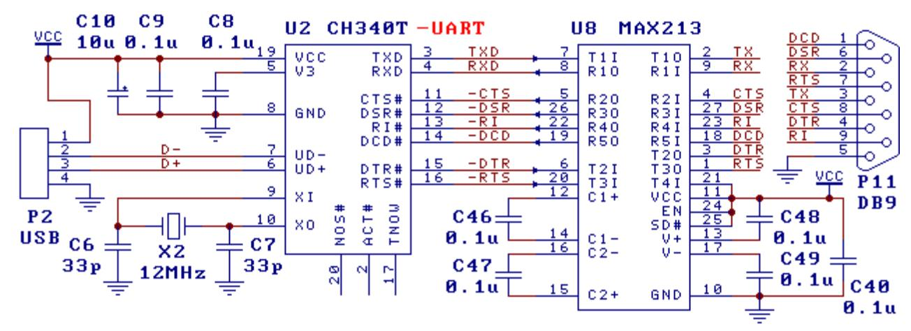

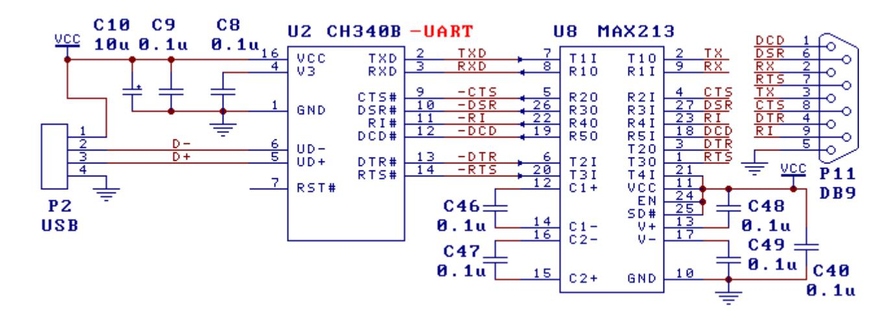

#### 7.2. USB 转 RS232 串口(下图)

图中是 USB 转最基本也最常用的 3 线制 RS232 串口,U5 为 MAX232/ICL232/SP232 等。 CH340 没有使用到的信号线都可以悬空。对于 CH340C/N/K/E/X/B 芯片,无需 X4 和 C21 及 C22。

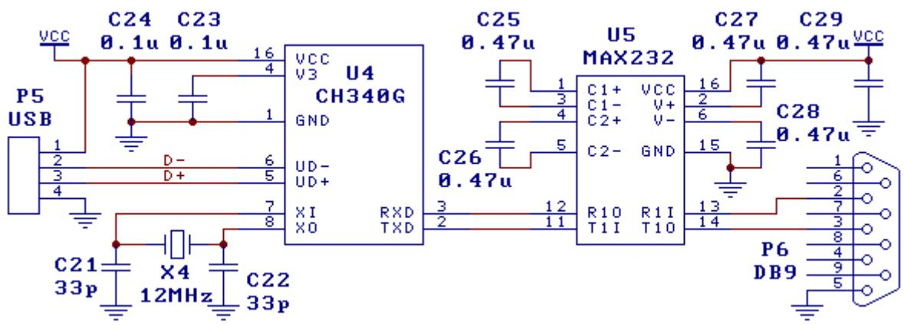

#### 7.3. USB 转 RS232 串口,简版(下图)

图中也是 USB 转 3 线制 RS232 串口,该电路与 7.2.节的功能相同,只是输出 RS232 信号的电平 幅度略低。CH340 的 R232 引脚为高电平,启用了辅助 RS232 功能,只需外加二极管、三极管、电阻 和电容就可代替 7.2.节中专用的电平转换电路 U5,所以硬件成本更低。

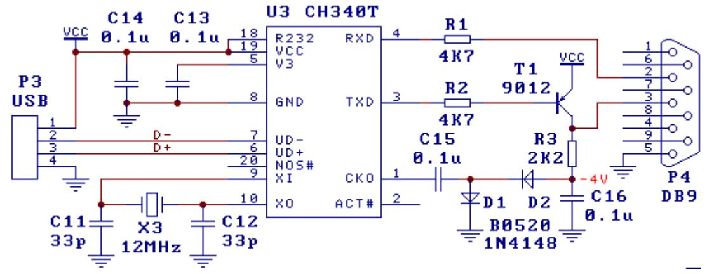

#### 7.4. USB 转 RS485 串口

可以用 TNOW 引脚控制 RS485 收发器的 DE(高有效发送使能)和 RE#(低有效接收使能)引脚。

#### 7.5. USB 红外适配器(下图)

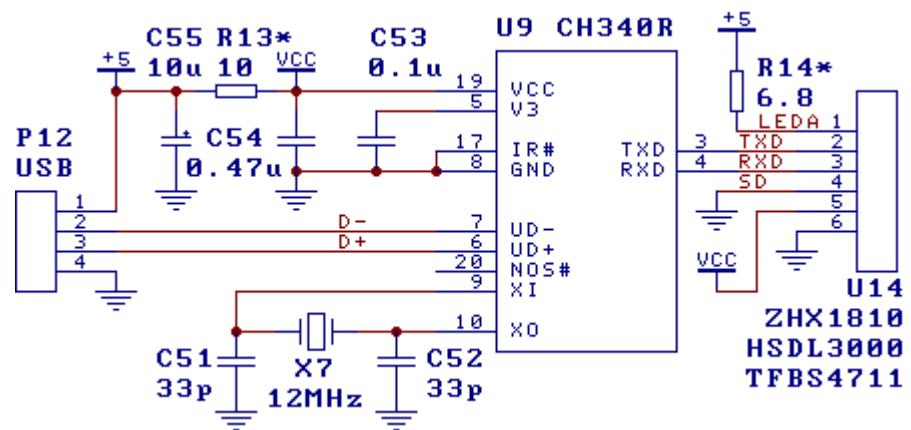

上图是由 USB 转 IrDA 红外芯片 CH340R 和红外线收发器 U14(ZHX1810/HSDL3000 等类似型号)构 成的 USB 红外线适配器。电阻 R13 用于减弱红外线发送过程中的大电流对其它电路的影响,要求不高 时可以去掉。限流电阻 R14 应该根据实际选用的红外线收发器 U14 的厂家的推荐值进行调整。

#### 7.6. 连接单片机串口,统一供电(下图)

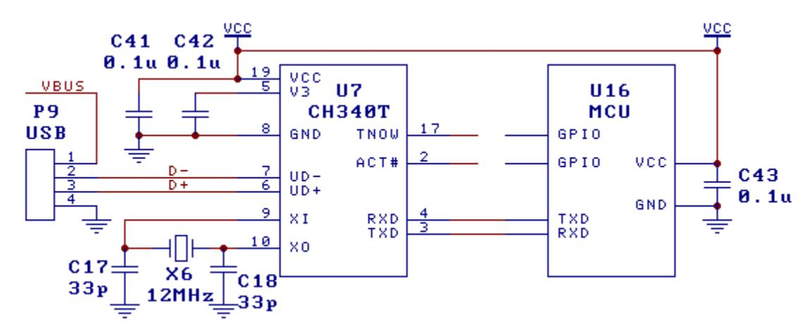

图中是统一供电方式下 MCU 单片机通过 TTL 串口连接 CH340 芯片实现 USB 通讯的参考电路。该产 品选择自供电方式,VCC 支持 5V 或者 3.3V(VCC 为 3.3V 时 V3 需短接到 VCC),完全不使用 USB 总线 电源 VBUS(如有需要 MCU 可以通过 I/O 串电阻后检测其是否有效)。CH340 与 MCU 使用同一电源 VCC, 所以 CH340 与 MCU 之间不存在双电源通过 I/O 相互电流倒灌的情形。

CH340 没有使用到的信号线都可以悬空。对于 CH340C/N/K/E/X/B 芯片,无需 X6 和 C17 及 C18。

#### 7.7. 连接 MCU,各自供电,双向防灌(下图)

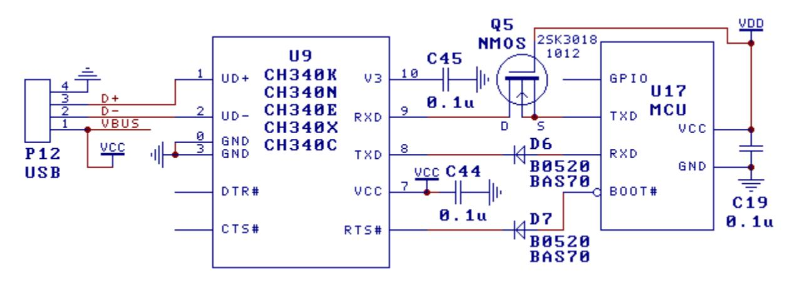

上图是双供电方式下 MCU 单片机通过 TTL 串口连接 CH340 芯片实现 USB 通讯的参考电路。CH340 由 USB 总线供电 VBUS,MCU 使用另一电源 VDD,VDD 支持 5V、3.3V 甚至 2.5V、1.8V。

图中 MCU 的 RXD 引脚应该启用内部上拉电阻,如没有,则建议对 RXD 引脚外加 2KΩ~22KΩ的上 拉电阻且接 MCU 的电源 VDD。

防 CH340 有电但 MCU 无电时的外灌。图中二极管 D6 和 D7 及 NMOS 管 Q5 用于防止双电源方式下 CH340 通过 MCU 的 RXD 或 TXD 内部二极管向失电 MCU 产生电流倒灌的问题,D7 和 RTS/BOOT0#的连接 是可选的。二极管 D6 针对 CH340 的 TXD 高电平通过 MCU 的 RXD 内部二极管向 MCU 倒灌电流的情形; 二极管 D7 针对 CH340 的 RTS 高电平通过 MCU 的 BOOT 内部二极管向 MCU 倒灌电流的情形;NMOS 管 Q5 针对 CH340 的 RXD 内部上拉电流通过 MCU 的 TXD 内部二极管向 MCU 倒灌电流的情形。

防 CH340 无电但 MCU 有电时的内灌。CH340K、CH340X 和批号 4 开头的 CH340C、CH340N 的 IO 都 自动防对内倒灌,即 CH340 无电但 MCU 有电时不会产生倒灌电流。再加上 D6、D7 和 Q5 能防止 CH340 向失电 MCU 外灌电流,所以上图能够实现完全的双向防倒灌。

对于其它批号或者型号的 CH340,需要另加防内灌电路。通常是一个 NMOS 管串联一个肖特基二 极管,防双向倒灌。例如,在 Q5 的漏极 D 端串联肖特基二极管且其阳极端接 CH340 的 RXD,在 D6 与 CH340 之间串接 NMOS 管且其漏极接 D6、栅极接 CH340 的电源 VCC。

如果确定某个情形不会发生,则相应的 NMOS 管或者二极管可以去掉。例如部分型号 MCU 的 IO 支 持防倒灌或支持 5VT,或者 MCU 有永久自备电源,不用担心 CH340 向 MCU 外灌电流,那么 D6、D7、Q5 均可以去掉并短路。

二极管优先用小功率的 Schottky 肖特基二极管 BAS70、BAT54,或 B0520 等。

NMOS 管优先用小功率、小电容的 NMOS 管 2SK3018、1012 等。

一般情况下,不建议 CH340 与 MCU 分开各自供电。如果确有必要,那么还可以选用 CH340K 或者 有 VIO 电源引脚支持 I/O 独立供电的 USB 转串口芯片 CH343。

### 7.8. 连接 MCU,各自供电,对内防灌(下图)

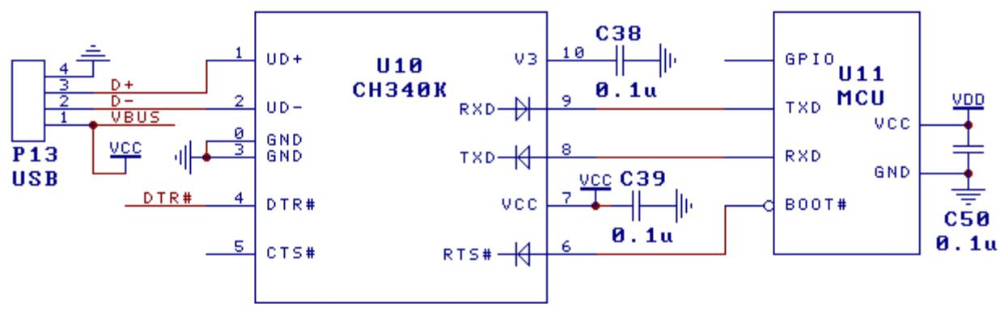

上图是双供电方式下 MCU 单片机通过 TTL 串口连接 CH340K 芯片实现 USB 通讯的参考电路。CH340K 由 USB 总线供电 VBUS(VCC),MCU 使用另一电源 VDD,VDD 支持 5V、3.3V 甚至 2.5V、1.8V。CH340K 封装的底板是可选 GND 引脚,根据 PCB 走线方便选择连接 GND 或者悬空。

CH340K 芯片的 TXD 和 RTS#引脚以及 RXD 引脚内置了防电流内灌的二极管(如图所示),同时内置 了约 75KΩ的弱上拉电阻以维持默认或空闲态的高电平(图中未标出),这样既能实现低电平驱动和 弱高电平驱动,也能减少 CH340K 与 MCU 各自独立供电时的电流倒灌。CH340K 能够完全防止 MCU 电源 对失电 CH340K 的电流内灌,也能减少 CH340K 电源对失电 MCU 的电流外灌(不超过 150μA)。

另外,CH340X 和批号 4 开头的 CH340C、CH340N 也都能够完全防止 MCU 电源对失电 CH340 的电流 内灌,从而避免 CH340 在 USB 断电后浪费 MCU 电源的电流。

如果需要完全防止 CH340K 电源对失电 MCU 的电流外灌,那么参考 7.7 节的图加 NMOS 和二极管。 当用于 120Kbps 以上通讯波特率时,建议为 MCU 的 RX 引脚启用内置或外加 2KΩ~22KΩ的上拉 电阻,或者选用有 VIO 电源引脚支持 I/O 独立供电的其它型号的 USB 转串口芯片。

CH340K 芯片的 DTR#引脚是普通推挽输出,CTS#引脚是内置了上拉电阻的普通输入。这两个引脚 均未内置二极管,都不具有防电流倒灌的功能,一般不用于连接 MCU。

DTR#可以用于控制 VCC 向 VDD 供电的电源开关,如下图所示可选 4 种电源控制方案。T4 方案和

Q1 方案(Q1 宜选 Vth 较低的 N-MOSFET)是简化方案,VDD 输出电压约为 VCC-0.8V,电流不超过 200mA; T6 方案和 Q3 方案是完整方案。图中 D10 用于防止 VDD 倒向 VCC 供电,是可选的。

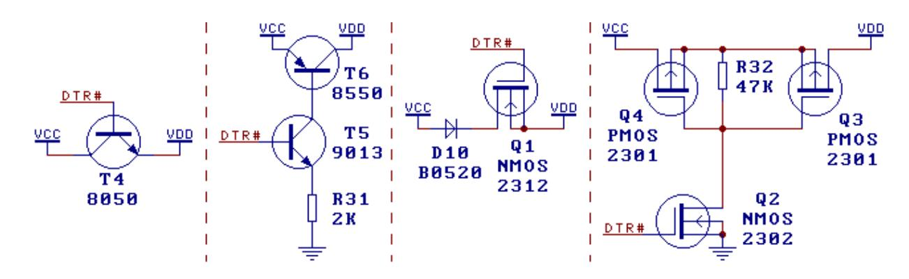

### 7.9. 单片机 USB 一键下载(下图)

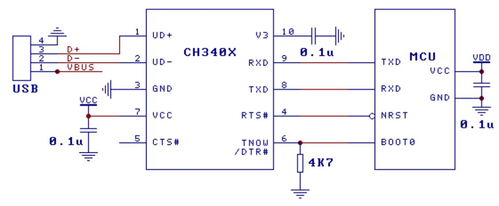

上图是基于 USB 转串口的多模式 MCU 一键下载参考电路,无需手工设置或手动复位。

上图针对的 MCU 类型:MCU 本身需支持串口一键下载,NRST 为低电平有效的复位输入端,BOOT0 默认低电平选择应用程序,高电平选择 Boot-Loader 下载。例如 32F103 等。

图中为 CH340X,4.7KΩ 下拉电阻可选范围 3~5.6KΩ,该电阻兼做 MCU 的 BOOT0 下拉电阻。对于 批号 4 开头且末 3 位大于 B40 的 CH340C,可以用 OUT#外加下拉电阻后作为第二 DTR#接 BOOT0。

注:对于 BOOT 模式电平相反的其它 MCU,可以直接用 CH340C/G 的 DTR#控制(默认高电平),或 者用 6#与 5#引脚之间接了电阻的 CH340X 的 DTR#控制(推挽 DTR 增强模式,默认高电平)。

MCU 正常工作状态:下拉电阻使得 CH340X 进入开源 DTR 增强模式,6#引脚切换为 DTR#,DTR#默 认不输出,BOOT0 保持低电平,RTS#默认高电平,MCU 正常运行应用程序。

一键下载:计算机端下载工具程序打开串口,设置 DTR#为高电平、设置 RTS#为低电平、再高电 平,MCU 进入 BOOT 下载程序。下载完成后,设置 DTR#为低电平、设置 RTS#为低电平、再高电平,MCU 正常运行应用程序,关闭串口前保持 DTR#不变。注意,MODEM 数据与引脚电平是反相的。

统一供电方式:CH340X 用 MCU 的同一 5V 或 3.3V 电源,缺点是 CH340X 将消耗数十 uA 的睡眠电 流。

独立供电方式:CH340X 使用 USB 的 VBUS 电源,完全不消耗 MCU 电源电流,CH340X 自身断电后基 本不影响 MCU 的 IO,但要避免部分 MCU 因 USB 有电但 MCU 无电而向 MCU 倒灌电的情况。如果需要完 全防止 CH340 电源对失电 MCU 的电流外灌,那么参考 7.7 节的图加 NMOS 和二极管。

如果 NRST 引脚需要支持额外的手动复位,那么可以在 RTS#与 NRST 之间串一个 1~2KΩ 电阻或者 阳极接 NRST 的二极管。