# High Performance Four Channels Audio ADC

# **FEATURES**

- High performance multi-bit delta-sigma audio ADC
- 102 dB signal to noise ratio
- -85 dB THD+N
- 24-bit, 8 to 100 kHz sampling frequency
- I 2 S/PCM master or slave serial data port
- Support TDM
- 256/384Fs, USB 12/24 MHz and other non standard audio system clocks
- Low power standby mode

# **APPLICATIONS**

- Mic array
- Smart speaker
- Far field voice capture

# **ORDERING INFORMATION**

ES7210 -40°C ~ +85°C QFN-32

# **BLOCK DIAGRAM**

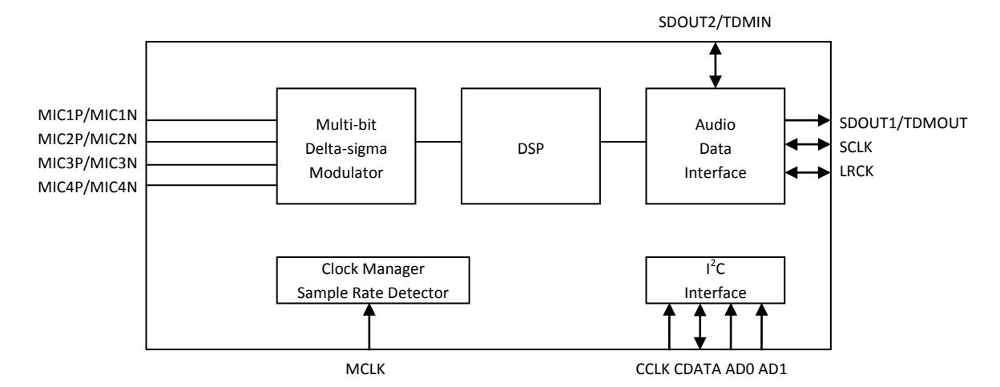

# **1. PIN OUT AND DESCRIPTION**

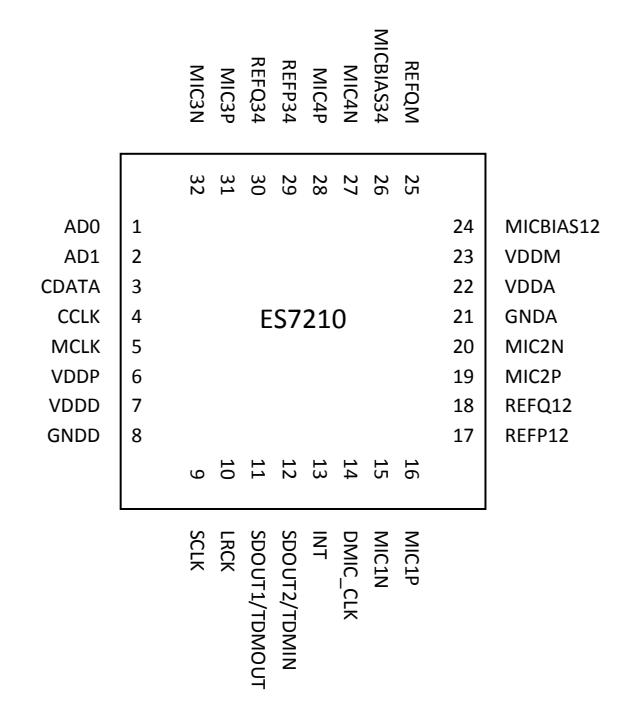

| Pin Name       | Pin number | Input or Output | Pin Description                                    |
|----------------|------------|-----------------|----------------------------------------------------|
| CCLK, CDATA    | 3, 4       | I/O             | 2 I C clock and data                         |
| AD0, AD1       | 1, 2       | I               | 2 I C address                                |
| MCLK           | 5          | I               | Master clock                                       |
| SCLK           | 9          | I/O             | Serial data bit clock                              |
| LRCK           | 10         | I/O             | Serial data left and right channel frame clock     |
| SDOUT1/TDMOUT  | 11         | O               |                                                    |
| SDOUT2/TDMIN   | 12         | I/O             | Serial data output or TDM data input and output |
| INT            | 13         | O               | Interrupt                                          |
| DMIC_CLK       | 14         | O               | Digital mic clock                                  |
| MIC1P, MIC1N   | 16, 15     |                 |                                                    |
| MIC2P, MIC2N   | 19, 20     |                 |                                                    |
| MIC3P, MIC3N   | 31, 32     | Analog          | Mic input                                          |
| MIC4P, MIC4N   | 28, 27     |                 |                                                    |
| MICBIAS12      | 24         |                 |                                                    |
| MICBIAS34      | 26         | Analog          | Mic bias                                           |
| VDDP           | 6          | Analog          | Power supply for the digital input and output      |
| VDDD, GNDD     | 7, 8       | Analog          | Digital power supply                               |
| VDDA, GNDA     | 22, 21     | Analog          | Analog power supply                                |
| VDDM           | 23         | Analog          | Analog power supply                                |
| REFP12, REFP34 | 17, 29     | Analog          | Filtering capacitor connection                     |
| REFQ12, REFQ34 | 18, 30     | Analog          | Filtering capacitor connection                     |
| REFQM          | 25         | Analog          | Filtering capacitor connection                     |

Latest datasheet: www.everest-semi.com or info@everest-semi.com

#### >VD DM **♦**VD DA GND (SVS) VDDA RE FQ 12 BNDA VDDM Vander Vander Vander REFPI FS7210 AD0 ADI CDATA місзі IIC CCLK 1uF MCIK SCLK IIS LRCK MICBIAS12 SDOUT 1/TDMOUT MIC2P SDOUT 2/TDM IN MIC2N **GPIO** MIC1N

#### 2. TYPICAL APPLICATION CIRCUIT

#### 3. CLOCK MODES AND SAMPLING FREQUENCIES

The device supports standard audio clocks (256Fs, 384Fs, 512Fs, etc), USB clocks (12/24 MHz), and some common non standard audio clocks (25 MHz, 26 MHz, etc).

According to the serial audio data sampling frequency (Fs), the device can work in two speed modes: single speed mode or double speed mode. In single speed mode, Fs normally ranges from 8 kHz to 48 kHz, and in double speed mode, Fs normally range from 64 kHz to 96 kHz.

The device can work either in master clock mode or slave clock mode. In slave mode, LRCK and SCLK are supplied externally, and LRCK and SCLK must be synchronously derived from the system clock with specific rates. In master mode, LRCK and SCLK are derived internally from device master clock.

#### 4. MICRO-CONTROLLER CONFIGURATION INTERFACE

The device supports standard  $I^2C$  micro-controller configuration interface. External micro-controller can completely configure the device through writing to internal configuration registers.

I2C interface is a bi-directional serial bus that uses a serial data line (CDATA) and a serial clock line (CCLK) for data transfer. The timing diagram for data transfer of this interface is given in Figure 1a and Figure 1b. Data are transmitted synchronously to CCLK clock on the CDATA line on a byte-by-byte basis. Each bit in a byte is sampled during CCLK high with MSB bit being transmitted firstly. Each transferred byte is followed by an acknowledge bit from receiver to pull the CDATA low. The transfer rate of this interface can be up to 400 kbps.

A master controller initiates the transmission by sending a "start" signal, which is defined as a high-to-low transition at CDATA while CCLK is high. The first byte transferred is the slave address. It is a seven-bit chip address followed by a RW bit. The chip address must be 1000 0x, where x equals AD1 AD0. The RW bit indicates the slave data transfer direction. Once an acknowledge bit is received, the data transfer starts to proceed on a byte-by-byte basis in the direction specified by the RW bit. The master can terminate the communication by generating a "stop" signal, which is defined as a low-to-high transition at CDATA while CCLK is high.

In I2C interface mode, the registers can be written and read. The formats of "write" and "read" instructions are shown in Table 1 and Table 2. Please note that, to read data from a register, you must set R/W bit to 0 to access the register address and then set R/W to 1 to read data from the register.

Table 1 Write Data to Register in I2C Interface Mode

|       | Chip Address   | R/W |     | Register Address |     | Data to be written |     |      |
|-------|----------------|-----|-----|------------------|-----|--------------------|-----|------|
| start | 1000 0 AD1 AD0 | 0   | ACK | RAM              | ACK | DATA               | ACK | Stop |

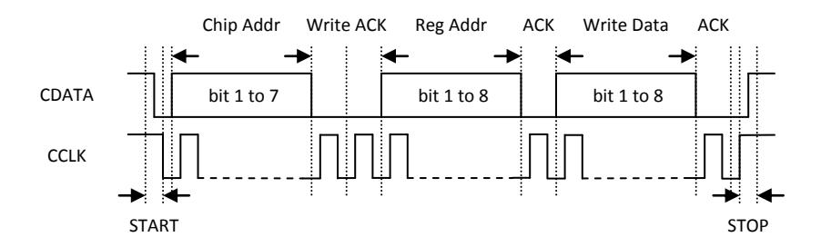

Figure 1a I2C Write Timing

Table 2 Read Data from Register in I2C Interface Mode

|       | Chip Address   | R/W |     | Register Address |      |      |
|-------|----------------|-----|-----|------------------|------|------|
| Start | 1000 0 AD1 AD0 | 0   | ACK | RAM              | ACK  |      |
| _     | Chip Address   | R/W |     | Data to be read  |      |      |
| Start | 1000 0 AD1 AD0 | 1   | ACK | Data             | NACK | Stop |

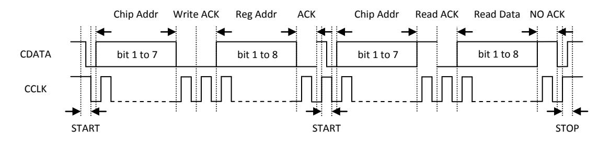

Figure 1b I2C Read Timing

# **5. DIGITAL AUDIO INTERFACE**

The device provides many formats of serial audio data interface to the output from the ADC through LRCK, SCLK and SDOUT pins. These formats are I2 S, left justified, DSP/PCM mode and TDM. ADC data is out at SDOUT on the falling edge of SCLK. The relationships of SDOUT, SCLK and LRCK with these formats are shown through Figure 2a to Figure 2h. ES7210 can be cascaded up to 16-ch through single I 2 S or TDM, please refer to the user guide for detail description.

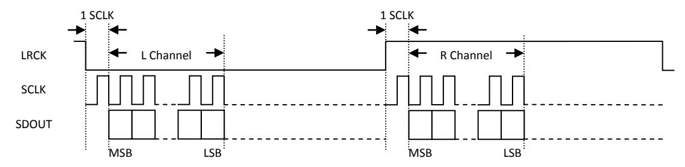

Figure 2a I2 S Serial Audio Data Format

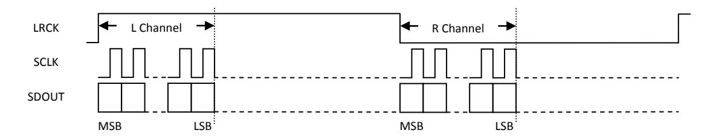

Figure 2b Left Justified Serial Audio Data Format

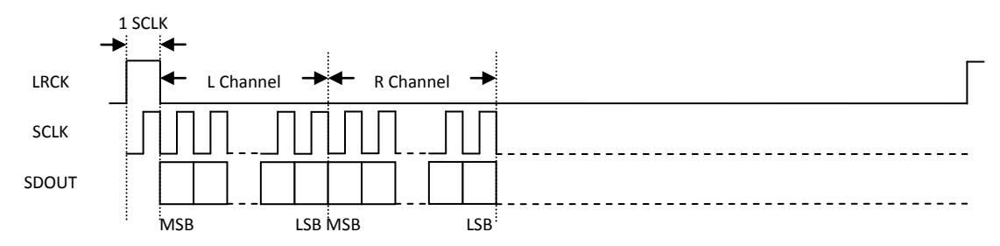

Figure 2c DSP/PCM Mode A Serial Audio Data Format

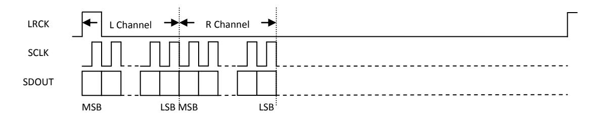

Figure 2d DSP/PCM Mode B Serial Audio Data Format

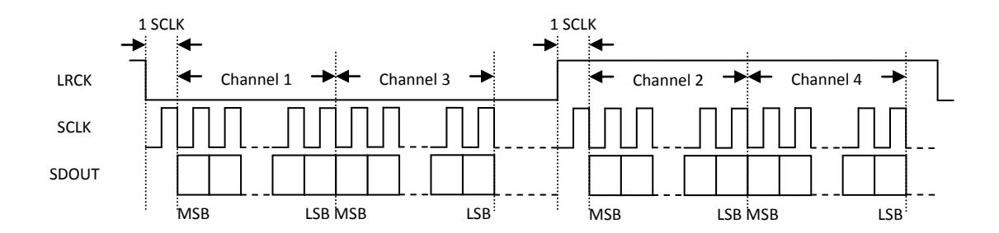

Figure 2e TDM I 2 S Serial Audio Data Format

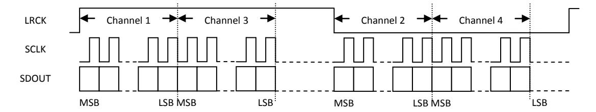

Figure 2f TDM Left Justified Serial Audio Data Format

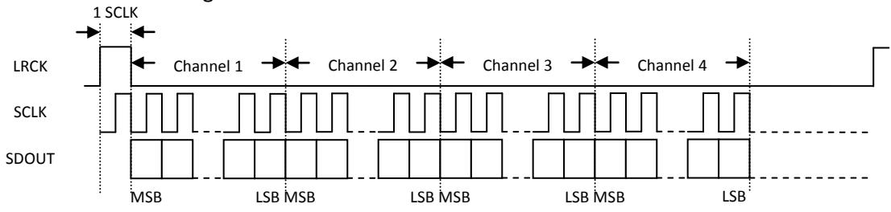

Figure 2g TDM DSP/PCM Mode A Serial Audio Data Format

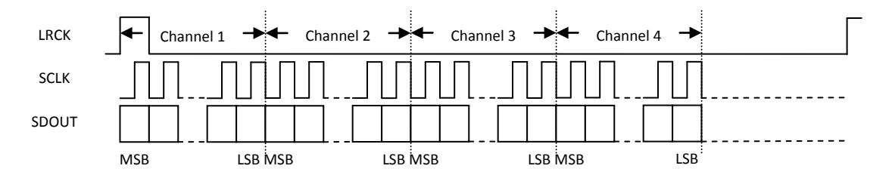

Figure 2h TDM DSP/PCM Mode B Serial Audio Data Format

# **6. ELECTRICAL CHARACTERISTICS**

#### *ABSOLUTE MAXIMUM RATINGS*

Continuous operation at or beyond these conditions may permanently damage the device.

| PARAMETER                    | MIN       | MAX       |
|------------------------------|-----------|-----------|
| Analog Supply Voltage Level  | -0.3V     | +3.6V     |
| Digital Supply Voltage Level | -0.3V     | +3.6V     |
| Analog Input Voltage Range   | GNDA-0.3V | VDDA+0.3V |
| Digital Input Voltage Range  | GNDD-0.3V | VDDP+0.3V |
| Operating Temperature Range  | -40C     | +85C     |
| Storage Temperature          | -65C     | +150C    |

#### *RECOMMENDED OPERATING CONDITIONS*

| PARAMETER | MIN           | TYP | MAX | UNIT |
|-----------|---------------|-----|-----|------|
| VDDD      | 1.6           | 3.3 | 3.6 | V    |
| VDDP      | 1.6           | 3.3 | 3.6 | V    |
| VDDA      | 1.6 (Note) | 3.3 | 3.6 | V    |
| VDDM      | 1.6           | 3.3 | 3.6 | V    |

Note: For VDDA is less than 2V, PGA gain must set above 30 dB.

#### *ADC ANALOG AND FILTER CHARACTERISTICS AND SPECIFICATIONS*

Test conditions are as the following unless otherwise specify: VDDA=3.3V, VDDD=3.3V, AGND=0V, DGND=0V, Ambient temperature=25C, Fs=48 KHz, 96 KHz or 192 KHz, MCLK/LRCK=256.

| PARAMETER                                   | MIN    | TYP | MAX    | UNIT |  |  |
|---------------------------------------------|--------|-----|--------|------|--|--|
| ADC Performance                             |        |     |        |      |  |  |
| Signal to Noise ratio (A-weigh)             | 95     | 102 | 104    | dB   |  |  |
| THD+N                                       | -88    | -85 | -75    | dB   |  |  |
| Channel Separation (1KHz)                   | 95     | 100 | 105    | dB   |  |  |
| Interchannel Gain Mismatch                  |        | 0.1 |        | dB   |  |  |
| Gain Error                                  |        |     | ±5     | %    |  |  |
| Filter Frequency Response – Single Speed |        |     |        |      |  |  |
| Passband                                    | 0      |     | 0.4535 | Fs   |  |  |
| Stopband                                    | 0.5465 |     |        | Fs   |  |  |
| Passband Ripple                             |        |     | ±0.05  | dB   |  |  |
| Stopband Attenuation                        | 70     |     |        | dB   |  |  |
| Filter Frequency Response – Double Speed |        |     |        |      |  |  |
| Passband                                    | 0      |     | 0.4167 | Fs   |  |  |
| Stopband                                    | 0.5833 |     |        | Fs   |  |  |
| Passband Ripple                             |        |     | ±0.005 | dB   |  |  |
| Stopband Attenuation                        | 70     |     |        | dB   |  |  |
| Filter Frequency Response – Quad Speed   |        |     |        |      |  |  |
| Passband                                    | 0      |     | 0.2083 | Fs   |  |  |

Latest datasheet: www.everest-semi.com or info@everest-semi.com

| Stopband               | 0.7917 |          |        | Fs   |  |
|------------------------|--------|----------|--------|------|--|
| Passband Ripple        |        |          | ±0.005 | dB   |  |
| Stopband Attenuation   | 70     |          |        | dB   |  |
| Analog Input           |        |          |        |      |  |
| Full Scale Input Level |        | AVDD/3.3 |        | Vrms |  |
| Input Impedance        |        | 6        |        | KΩ   |  |

#### *DC CHARACTERISTICS*

| PARAMETER                               | MIN      | TYP  | MAX | UNIT |  |
|-----------------------------------------|----------|------|-----|------|--|
| Normal Operation Mode (Fs=16 KHz) |          |      |     |      |  |
| VDDD=1.8V, VDDP=1.8V, VDDA=3.3V         |          | 63   |     | mW   |  |
| VDDD=1.8V, VDDP=1.8V, VDDA=1.8V         |          | 24   |     |      |  |
| Power Down Mode                         |          |      |     |      |  |
| VDDD=1.8V, VDDP=1.8V, VDDA=3.3V         |          | 10   |     | uA   |  |
| Digital Voltage Level                   |          |      |     |      |  |
| Input High-level Voltage                | 0.7*VDDP |      |     | V    |  |
| Input Low-level Voltage                 |          |      | 0.5 | V    |  |
| Output High-level Voltage               |          | VDDP |     | V    |  |
| Output Low-level Voltage                |          | 0    |     | V    |  |

### *SERIAL AUDIO PORT SWITCHING SPECIFICATIONS*

| PARAMETER                   | Symbol | MIN | MAX  | UNIT |
|-----------------------------|--------|-----|------|------|
| MCLK frequency              |        |     | 51.2 | MHz  |
| MCLK duty cycle             |        | 40  | 60   | %    |
| LRCK frequency              |        |     | 200  | KHz  |
| LRCK duty cycle             |        | 40  | 60   | %    |
| SCLK frequency              |        |     | 26   | MHz  |
| SCLK pulse width low        | TSCLKL | 15  |      | ns   |
| SCLK Pulse width high       | TSCLKH | 15  |      | ns   |
| SCLK falling to LRCK edge   | TSLR   | –10 | 10   | ns   |
| SCLK falling to SDOUT valid | TSDO   | 11  |      | ns   |

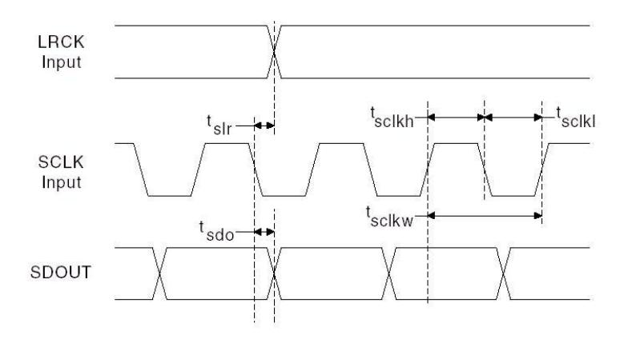

Figure 3 Serial Audio Port Timing

#### *I 2 C SWITCHING SPECIFICATIONS*

| PARAMETER                               | Symbol | MIN | MAX | UNIT |
|-----------------------------------------|--------|-----|-----|------|
| CCLK Clock Frequency                 | FCCLK  |     | 400 | KHz  |
| Bus Free Time Between Transmissions     | TTWID  | 1.3 |     | us   |
| Start Condition Hold Time               | TTWSTH | 0.6 |     | us   |
| Clock Low time                          | TTWCL  | 1.3 |     | us   |
| Clock High Time                      | TTWCH  | 0.4 |     | us   |
| Setup Time for Repeated Start Condition | TTWSTS | 0.6 |     | us   |
| CDATA Hold Time from CCLK Falling | TTWDH  |     | 900 | ns   |
| CDATA Setup time to CCLK Rising   | TTWDS  | 100 |     | ns   |
| Rise Time of CCLK                       | TTWR   |     | 300 | ns   |
| Fall Time CCLK                          | TTWF   |     | 300 | ns   |

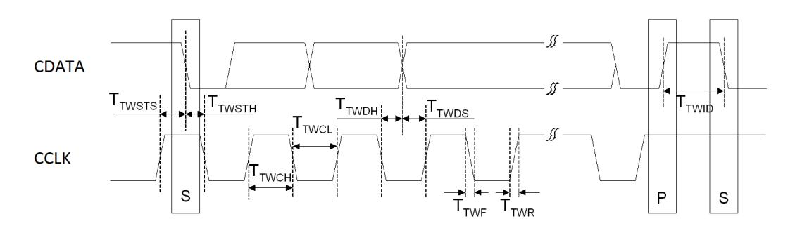

Figure 4 I 2 C Timing

# **7. PACKAGE**

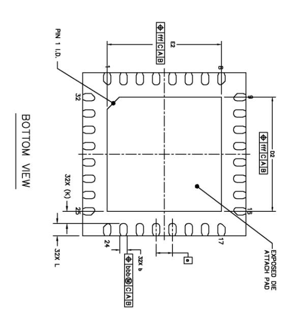

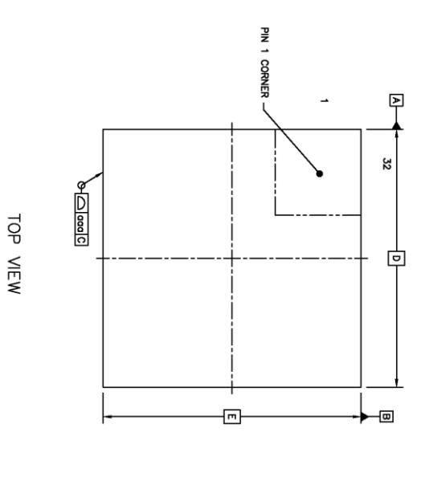

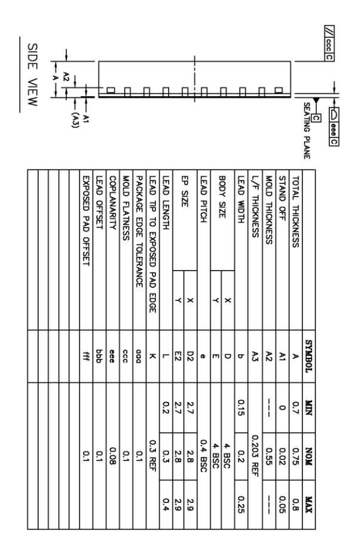

# **8. CORPORATE INFORMATION**

Everest Semiconductor Co., Ltd.

No. 1355 Jinjihu Drive, Suzhou Industrial Park, Jiangsu, P.R. China, Zip Code 215021

苏州工业园区金鸡湖大道 1355 号国际科技园, 邮编 215021

Email: [info@everest-semi.com](mailto:info@everest-semi.com)

