# CH334/CH335 数据手册

V2 4

http://wch.cn

# 概述

CH334 和 CH335 是符合 USB2. 0 协议规范的 4 端口 USB HUB 控制器芯片,上行端口支持 USB2. 0 高速和全速,下行端口支持 USB2. 0 高速 480Mbps、全速 12Mbps 和低速 1. 5Mbps。不但支持低成本的 STT 模式(单个 TT 分时调度 4 个下行端口),还支持高性能的 MTT 模式(4 个 TT 各对应 1 个端口,并发处理)。

工业级设计,外围精简,可应用于计算机和工控机主板、外设、嵌入式系统等。

# 特点

- 4 口 USB 集线器,提供 4 个 USB2. 0 下行端口,向下兼容 USB1. 1 协议规范
- 支持各端口独立电源控制或 GANG 整体联动电源控制
- 支持各端口独立过流检测或 GANG 整体过流检测,支持 5V 耐压过流信号输入
- 支持高性能的 MTT 模式,为每个端口提供独立 TT 实现满带宽并发传输,总带宽是 STT 的 4 倍
- 支持端口状态 LED 指示灯
- 可通过外部 EEPROM 配置是否支持复合设备、不可移除设备、自定义 VID、PID 和端口配置
- 内置信息存储器,针对行业特殊需求可批量定制厂商或产品信息及配置,无需 EEPROM
- 自研的专用 USB PHY, LPM 低功耗技术,相比第一代 HUB 芯片大幅降低,支持自供电或总线供电
- 可通过 I/O 引脚或外部 EEPROM 配置自供电或总线供电模式
- 提供晶体振荡器,内置电容,支持外部 12MHz 输入,内置 PLL 为 USB PHY 提供 480MHz 时钟
- 内置专业的高精度时钟,可以选择去掉外部 12MHz 晶体,节省成本、减小体积和降低 EMI
- 上行端口内置 1.5KΩ上拉电阻,下行端口内置 USB Host 主机所需下拉电阻,外围精简
- 内置 LDO 线性降压调节器,可将 USB 总线电源电压转换为芯片的 3.3V 工作电源
- CH335 支持 MCU 控制上行端口与 1#下行端口交换
- USB 引脚具有 6KV 增强 ESD 性能, Class 3A
- 工业级温度范围: -40~85℃
- 提供 QFN28、QFN24、QFN16、QFN12、SOP16、QSOP28 等多种封装形式

## 第1章 引脚

### 1.1 引脚排列

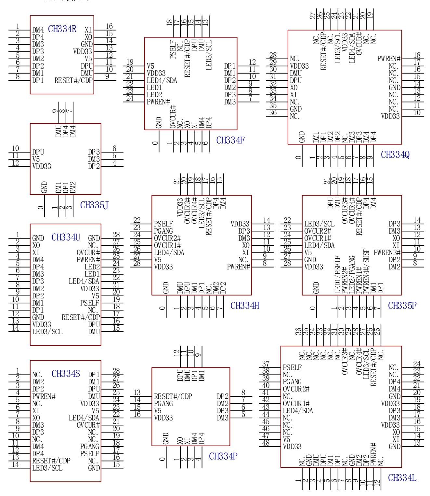

图 1-1 引脚分布

注: 0#引脚是指 QFN 封装的底板。

## 1.2 型号对比

表 1-1 同簇型号功能对比

| 型号        | CH335J   | CH334P | CH334R | CH334U CH334F | CH334S CH334Q | CH334H CH334L | CH335F  |
|-----------|----------|--------|--------|------------------|------------------|------------------|---------|
| TT 模式     | MTT      | MTT    | MTT    | MTT              | MTT              | MTT              | MTT     |
| 过流检测      | ×        | ×      | × ×    |                  | GANG 模式          | 独立/GANG          | 独立/GANG |
| 电源控制      | X        | ×      | ×      | GANG 模式          | GANG 模式          | GANG 模式          | 独立/GANG |
| LED 指示灯   | ×        | 1 灯    | ×      | 5 灯              | 1 灯              | 1 灯              | 5 灯/9 灯 |
| 1/0 引脚配置  | ×        | ×      | ×      | √                | <b>√</b>         | √                | √       |
| 供电模式      | ^        | ^      |        |                  |                  |                  |         |
| 外部 EEPROM | ×        | ×      | ~      | ,                | ,                | ,                | /       |
| 提供配置信息    | ×        | ^      | ×      | √                | √                | √                | √    |
| 定制配置信息    | √        | √      | √      | √                | √                | √                | √       |
| 免晶振应用     | <b>√</b> | 可选     | 可选     | 可选               | 可选               | 可选               | 可选      |
| 交换上行端口    | ×        | ×      | ×      | ×                | ×                | ×                | 可选      |

# 1.3 封装

表 1-2 封装说明

| 封装形式      | 塑体宽度   |        | 引脚       | 间距       | 封装说明          | 订货型号   |
|-----------|--------|--------|----------|----------|---------------|--------|
| QS0P16    | 3. 9mm | 150mil | 0. 635mm | 25mil    | 1/4 尺寸 16 脚贴片 | CH334R |
| QS0P28    | 3. 9mm | 150mil | 0. 635mm | 25mil    | 1/4 尺寸 28 脚贴片 | CH334U |
| SS0P28    | 5. 3mm | 209mil | 0. 65mm  | 25mil    | 缩小型 28 脚贴片    | CH334S |
| QFN12_2x2 | 2*2mm  |        | 0. 4mm   | 15.7mil  | 四边无引线 16 脚    | CH335J |
| QFN16_3x3 | 3*3mm  |        | 0. 5mm   | 19. 7mil | 四边无引线 16 脚    | CH334P |
| QFN24_4×4 | 4*4mm  |        | 0. 5mm   | 19. 7mil | 四边无引线 24 脚    | CH334F |
| QFN28_4x4 | 4*4mm  |        | 0. 4mm   | 15.7mil  | 四边无引线 28 脚    | CH335F |
| QFN28_5x5 | 5*5mm  |        | 0. 5mm   | 19. 7mil | 四边无引线 28 脚    | СН334Н |
| QFN36_6×6 | 6*6mm  |        | 0. 5mm   | 19. 7mil | 四边无引线 36 脚    | CH334Q |
| LQFP48    | 7*7mm  |        | 0. 5mm   | 19. 7mil | 标准 LQFP48 脚贴片 | CH334L |

注: 优选 CH334P 和 CH335J, 体积小; CH335 引脚全;

其它封装形式侧重于 PCB 兼容;新设计不建议选择 CH334S/H/Q/L; CH334L 仅批量预订。

# 1.4 引脚描述

表 1-3 引脚定义

| i    | 引脚号(同名引脚可参考) |                  | 引脚        |          | 44 VK 144 / 4        |        |    |                      |     |                                 |
|------|--------------|------------------|-----------|----------|----------------------|--------|----|----------------------|-----|---------------------------------|
| 335F | 4R           | 4F               | 4U        | 48       | 4Q                   | 4H     | 4L | 名称                   | 类型  | 功能描述                            |
| 20   | 10           | 14               | 15        | 25       | 30                   | 1      | 3  | DMU                  | USB | 上行端口 USB2. 0 信号线 D-             |
| 21   | 11           | 15               | 16        | 26       | 31                   | 2      | 4  | DPU                  | USB | 上行端口 USB2. 0 信号线 D+             |
| 6    | 7            | 11               | 10        | 27       | 1                    | 3      | 5  | DM1                  | USB | 1#下行端口 USB 信号线 D-               |
| 7    | 8            | 12               | 11        | 28       | 2                    | 4      | 6  | DP1                  | USB | 1#下行端口 USB 信号线 D+               |
| 8    | 5            | 9                | 8         | 2        | 3                    | 6      | 9  | DM2                  | USB | 2#下行端口 USB 信号线 D-               |
| 9    | 6            | 10               | 9         | 3        | 4                    | 7      | 10 | DP2                  | USB | 2#下行端口 USB 信号线 D+               |
| 13   | 3            | 7                | 6         | 8        | 6                    | 12     | 17 | DM3                  | USB | 3#下行端口 USB 信号线 D-               |
| 14   | 4            | 8                | 7         | 9        | 7                    | 13     | 18 | DP3                  | USB | 3#下行端口 USB 信号线 D+               |
| 15   | 1            | 5                | 4         | 11       | 8                    | 15     | 21 | DM4                  | USB | 4#下行端口 USB 信号线 D-               |
| 16   | 2            | 6                | 5         | 12       | 9                    | 16     | 22 | DP4                  | USB | 4#下行端口 USB 信号线 D+               |
| 11   | 16           | 4                | 3         | 6        | 33                   | 10     | 14 | ΧI                   | I   | 晶体振荡器输入端,接外部晶体一端                |
| 12   | 15           | 3                | 2         | 7        | 32                   | 11     | 15 | ХО                   | 0   | 晶体振荡器反相输出端,接外部晶体另一端             |
| 17   |              | 7 40             | 00        | 17       | 00                   | RESET# |    | 外部复位输入,内置上拉电阻,低电平有效, |     |                                 |
| 17   | 9            | 16               | 17        | 13       | 26                   | 17     | 26 | CDP                  | 51  | 不复位时建议完全悬空                      |
| 26   | 12           | 19               | 20        | 23       | _                    | 27     | 47 | V5                   | Р   | 5V 或 3. 3V 电源输入,外接 1uF 或更大电容    |
| 20   | 13           | 20 21 24 20 20 4 | 40 1/0000 | Р        | 主电源,LDO 输出及 3.3V 输入, |        |    |                      |     |                                 |
| 28   | 13           | 20               | 21        | 24       | 29                   | 28     | 48 | VDD33                | P   | 外接 0. 1uF+10uF 退耦电容,或 1uF 退耦电容  |
| _    |              | -                | 13        |          | 10                   | 14     | 16 | VDD33                | Р   | 3. 3V 电源输入,外接 1uF 或 0. 1uF 退耦电容 |
|      |              | 1                | 2         |          | 23                   | 21     | 19 | νυυσσ                | ٢   | 3.3V 电源删入,外按 Tur 및 U. Tur 返柄电合  |
|      |              |                  | 1         |          |                      |        | 2  |                      |     |                                 |
| 27   | 14           | -                | 12        | 15       | 14                   | _      | 8  | GND                  | Р   | 公共接地端                           |
| 21   | 14           |                  | 28        | 13       | 35                   |        | 13 | GIND                 | r   | 4 六)女心物                         |
|      |              |                  | 20        |          |                      |        | 20 |                      |     |                                 |
| 0    | -            | 0                | -         | -        | 0                    | 0      | -  | GND                  | Р   | 公共接地端 (底板)                      |
| 24   | 1            | 1                | 26        | 21       | 21                   | 25     | 42 | 0VCUR#               | 51  | GANG 整体模式下行端口过流检测输入引脚;          |
| 24   |              |                  | 20        | <u> </u> |                      | 20     | 44 | 0VCUR1#              | J I | 1#下行端口过流检测输入引脚,低电平过流            |
| 23   | _            | 1                | 1         | _        | 1                    | 24     | 40 | 0VCUR2#              | 51  | 2#下行端口过流检测输入引脚,低电平过流            |
| 19   | ı            | I                | _         | _        | I                    | 20     | 30 | OVCUR3#              | 51  | 3#下行端口过流检测输入引脚,低电平过流            |
| 18   | ı            | I                | _         | _        | I                    | 19     | 28 | OVCUR4#              | 51  | 4#下行端口过流检测输入引脚,低电平过流            |
| 4    |              | 0.4              | 0E        | А        | 10                   | o      | 11 | PWREN#               |     | GANG 整体模式下行端口电源输出控制引脚;          |
| 4    |              | 24               | 25        | 4        | 18                   | 8      | 11 | PWREN1#              | 0   | 1#下行端口电源输出控制引脚,低电平开启            |

|    |   |    | 1        | 1                              |    |    |    | 1               |     |                                                                                                                                    |
|----|---|----|----------|--------------------------------|----|----|----|-----------------|-----|------------------------------------------------------------------------------------------------------------------------------------|
| 2  | _ | -  | -        | _                              | -  | -  | -  | PWREN2#         | 0   | 2#下行端口电源输出控制引脚,低电平开启                                                                                                               |
| 10 | _ | _  | -        | _                              | _  | _  | _  | PWREN3#         | 0   | 3#下行端口电源输出控制引脚,低电平开启                                                                                                               |
| 5  | _ | -  | -        | _                              | _  | _  | _  | SUSP PWREN4# | 0   | GANG 整体模式 SUSPEND 睡眠状态输出引脚,高电平指示睡眠态,低电平指示正常态;4#下行端口电源输出控制引脚,低电平开启                                                                  |
| _  | - | 18 | 19       | 17                             |    | 22 | 37 | PSELF           | I   | 配置供电模式,内置上拉电阻: 默认高电平为自供电,低电平设置为总线供电                                                                                                |
| _  | - | -  | -        | 18                             | -  | 23 | 39 | PGANG           | 1/0 | 在复位期间配置电源过流保护模式,内置上拉电阻。在复位完成后转为睡眠/正常状态输出: 默认高电平为整体过流检测和整体电源控制, 复位后输出低指示正常态,高指示睡眠态; 外加下拉电阻置低为独立过流检测,复位后输 出高指示正常态,低指示睡眠态 |
| 1  | _ | 22 | 23       | _                              | _  | _  | _  | LED1 PSELF   | 1/0 | LED1:端口状态指示信号 1; PSELF:在复位期间配置供电模式,内置上拉, 默认高为自供电,外加下拉置低为总线供电                                                                    |
| 3  | _ | 23 | 24       | _                              | _  | _  | _  | LED2 PGANG   | 1/0 | LED2:端口状态指示信号 2; PGANG:在复位期间配置电源过流保护模式,内置上拉,默认高为整体过流检测和整体电源控制,外加下拉置低为独立过流检测                                                     |
| 22 | _ | 13 | 14       | 14                             | 24 | 18 | 27 | LED3 SCL     | 1/0 | LED3:端口状态指示信号 3; SCL:在复位期间为 EEPROM 时钟信号线输出                                                                                      |
| 25 | _ | 21 | 22       | 22                             | 22 | 26 | 43 | LED4 SDA     | 1/0 | LED4:端口状态指示信号 4; SDA:在复位期间为 EEPROM 双向数据信号线                                                                                      |
| _  | _ | 2  | 18 27 | 1 5 10 16 19 20 | *  | 5  | *  | NC.             |     | 空脚或保留引脚,禁止连接                                                                                                                       |

## 引脚类型:

- (1) I: 3.3V 信号输入。
- (2) 0: 3.3V 信号输出。
- (3) 51: 额定 3. 3V 信号输入,支持 5V 耐压。
- (4) P: 电源或地。

# 第2章 结构

## 2.1 系统结构

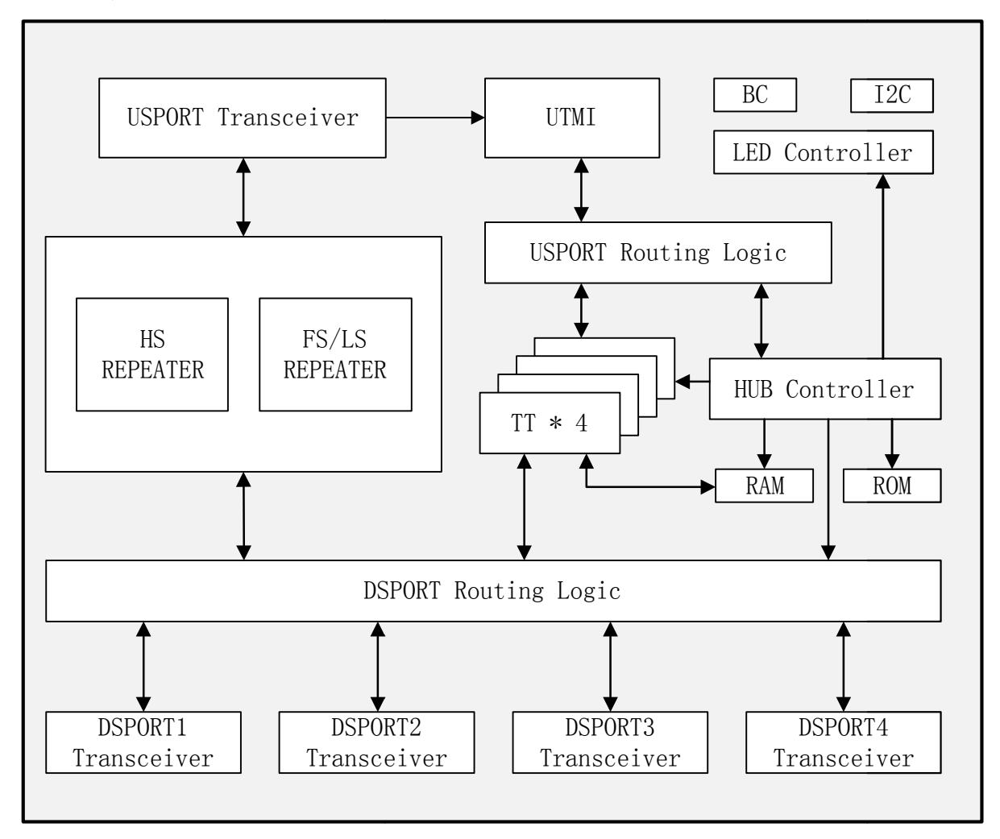

图 2-1 系统框图

图 2-1 是 HUB 控制器系统内部结构框图。HUB 控制器主要包括三大模块: Repeater、TT 和控制器。 控制器类似 MCU 处理器,用于全局管理和控制。当上行端口与下行端口速度一致时,路由逻辑会将端口连接至 Repeater,当上行端口与下行端口速度不一致时,路由逻辑会将端口连接至 TT。

TT 分为单个 TT 和多个 TT 两种,即 STT 和 MTT,STT 是单个 TT 核分时调度处理 USB 主机下发至 所有下行端口的事务,MTT 指多个 TT 并行,是 4 个 TT 核分别对应并实时处理一个下行端口的事务,因此 MTT 可以为各下行端口的接入设备提供更满的带宽,更好的支持多端口大数据量的并发传输。

注:

USPORT Transceiver: 上行端口收发器 PHY DSPORT Transceiver: 下行端口收发器 PHY

REPEATER: HUB 中继器

TT: 处理转换器。

# 第3章 功能

## 3.1 过流检测

CH334/CH335 支持三种过流保护模式: Individual 独立控制电源和独立过流检测、GANG 整体控制电源和独立过流检测、GANG 整体联动控制电源和整体过流检测(默认模式),如表 3-1 所示。

| 过流保护模式              | 电源控制引脚            | 过流检测的采样引脚                          | 参考图     |  |
|---------------------|-------------------|------------------------------------|---------|--|
| 까까 ☆ 樺 <del>↑</del> | PWREN1#, PWREN2#, | OVCUR1#, OVCUR2#, OVCUR3#, OVCUR4# | 图 3-1-1 |  |
| 双独立模式               | PWREN3#, PWREN4#  | UVGURT#, UVGURZ#, UVGUR3#, UVGUR4# | 图 3-1-1 |  |
| 整控独检模式              | PWREN# (PWREN1#)  | OVCUR1#, OVCUR2#, OVCUR3#, OVCUR4# | 图 3-1-2 |  |
| GANG 整体模式           | PWREN# (PWREN1#)  | OVCUR# (OVCUR1#)                   | 图 3-1-3 |  |

表 3-1 过流保护控制引脚说明

CH335F 支持双独立模式和 GANG 整体模式; CH334H/L 支持整控独检模式和 GANG 整体模式; CH334U/S/F/Q 只支持 GANG 整体模式; CH334R/P/CH335J 不支持过流检测。

### 3.1.1 双独立模式

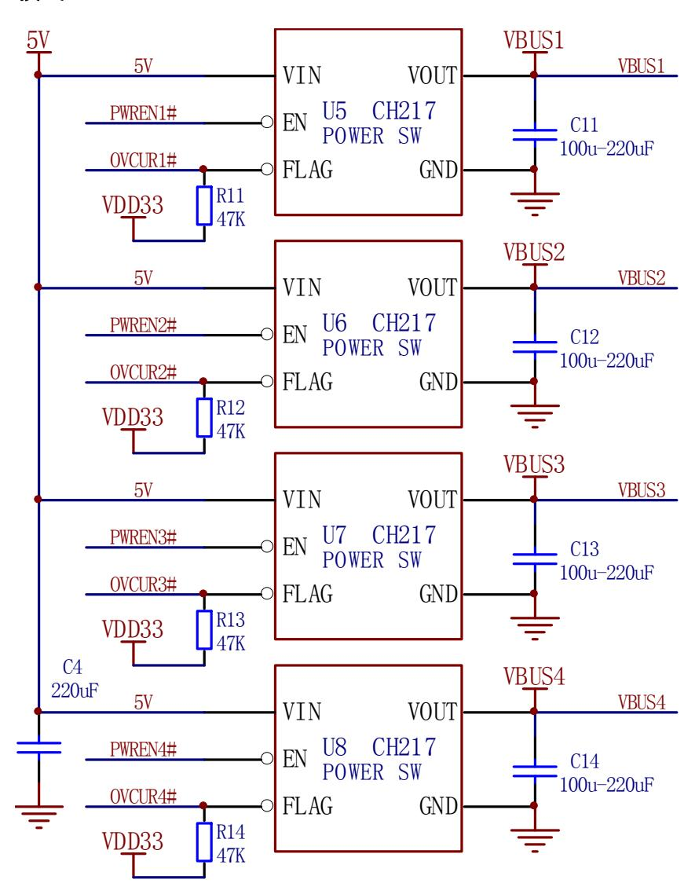

#### 图 3-1-1 双独立模式, R11~R14 可省掉

U5~U8 为 USB 限流配电开关芯片,内部集成了过流检测,用于 VBUS 电源分配管理,例如 CH217 芯片或类似功能的芯片。在 5V 没有外部供电的应用中,建议通过 ISET 外接电阻将限流设置在 1A 以下甚至 500mA。U5~U8 的 FLAG 引脚是开漏输出,需要 R11~R14 分别上拉。默认配置下  $0C_L$ EVEL=0,HUB 芯片的 0VCUR#引脚提供内置的弱上拉电流,所以可省掉 R11~R14。C11~C14 容量根据需要选择,规范中最低 120uF。双独立模式需要设置 GANG MODE=0 选择独立过流检测模式。

图中, VBUS1/VBUS2/VBUS3/VBUS4 分别连接下行端口 1/2/3/4 的 VBUS 电源引脚。

### 3.1.2 整控独检模式

优选的整控独检电路是基于图 3-1-1 双独立模式电路改动,用 PWREN#同时控制 U5 $\sim$ U8。考虑到 4 组开关开启时 C11 $\sim$ C14 同时充电,建议 C4 容量不小于 C11 $\sim$ C14 累计容量。

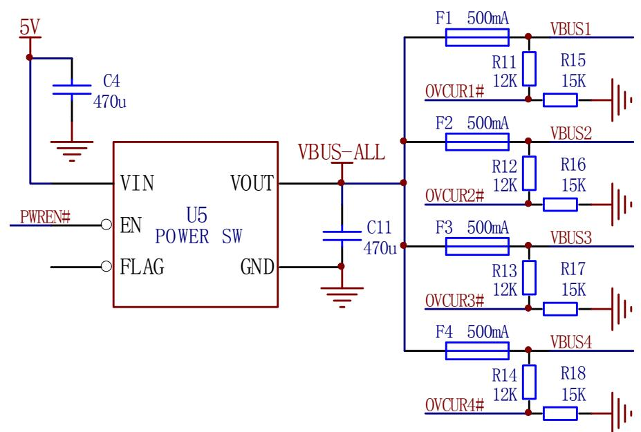

图 3-1-2 整控独检模式的另一种非优选电路

图 3-1-2 是另一种选择,U5 是合用的电源开关芯片,F1 $\sim$ F4 是保险电阻,C11 根据需要选择。 另外,还有一种去掉电源控制的简化应用,基于图 3-1-2 省掉 U5/C4 并将 VBUS-ALL 短接到 5V。

#### 3.1.3 GANG 整体模式

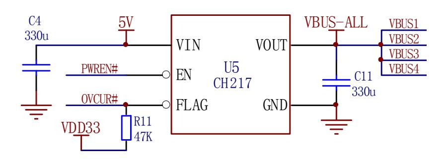

#### 图 3-1-3 GANG 整体模式, R11 可省掉

U5 为 USB 限流电源开关芯片。默认配置下可以省掉 R11。C11 的容量可以根据需要选择。VBUS-ALL 同时连接下行端口 1/2/3/4 的 VBUS 电源引脚。U5 的限流设置值需考虑 4 个下行端口及是否自供电。

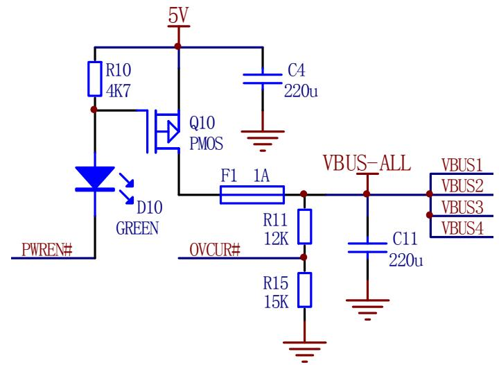

图 3-1-4 简化的 GANG 整体模式电源控制和过流检测电路示意图

图 3-1-4 为简化示意图,仅作原理参考。默认配置下 0C\_LEVEL=0,R11 和 R15 分压选择过流检测 点为 VBUS 降到 4V 左右。如果配置 0C\_LEVEL=1,那么可以去掉 R15,将 R11 改为 1K。

## 3.2 复位

芯片内嵌有上电复位模块,一般情况下,无需外部提供复位信号。同时也提供了外部复位输入引脚 RESET#/CDP,该引脚内置有上拉电阻。

#### 3.2.1 上电复位

当电源上电时,芯片内部 POR 上电复位模块会产生上电复位时序,并延时 Trpor 约  $5mS\sim14mS$  以等待电源稳定。其中,批号倒数第 6 位为 6 的芯片,Trpor 约 12mS;默认供应批号倒数第 6 位为 1 的芯片,Trpor 约  $5mS\sim7mS$ 。在运行过程中,当电源电压低于  $V_{lvr}$ 时,芯片内部 LVR 低压复位模块会产生低压复位直到电压回升,并延时以等待电源稳定。图 3-2-1 为上电复位过程以及低压复位过程。

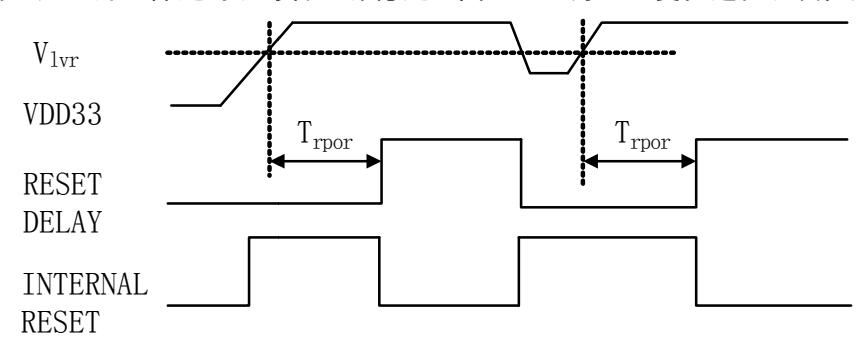

图 3-2-1 上电期间的复位

### 3.2.2 外部复位

外部复位输入引脚 RESET#/CDP 已内置约  $25K\Omega$ 上拉电阻,如果外部需要对芯片进行复位,那么可以将该引脚驱动为低电平,驱动内阻建议不大于  $800\Omega$ ,复位的低电平脉宽需要大于 4uS。

| RESET#/CDP 引脚 | 条件          | 结果              |  |  |
|---------------|-------------|-----------------|--|--|
| 驱动为低电平        | 上电期间或正常工作期间 | 复位 HUB 芯片       |  |  |
| 驱动为高电平        | 上电期间        | 启用 CDP,关闭低功耗睡眠  |  |  |
| 不驱动或不连接 (默认)  | 上电期间        | 不启用 CDP,支持低功耗睡眠 |  |  |
| 驱动为高电平或不驱动    | 正常工作期间      | 没有影响            |  |  |

表 3-2 复位引脚控制与模式说明

注: CDP 属于可配置功能, 部分封装形式/部分批次的 CH334/5 可能未开放 CDP。

对于 MCU 引脚直接驱动 HUB 芯片 RESET#/CDP 引脚的应用,如果上电期间 MCU 引脚输出高电平则可能会启用 CH334/CH335 的充电功能并关闭低功耗睡眠,如需避免启用充电功能并降低睡眠电流,那么需要在 MCU 引脚与 HUB 芯片 RESET#/CDP 引脚之间串联二极管,参考图 3-2-2。

图 3-2-2 MCU 引脚驱动复位且避免启用充电功能

#### 3.2.3 充电功能

除了 CDP, 还可以提供 Type-C 及 USB PD 高压快充整机方案。

# 3.3 LED 指示灯

根据 USB2. 0 协议规范,CH334/CH335 提供了下行端口状态 LED 指示灯控制引脚,端口对应的绿灯亮起表明端口状态正常,绿灯熄灭表明端口无设备或挂起 Suspend,端口对应的红灯亮起表明端口异常。CH334/CH335 根据封装的不同,可以动态分时驱动支持 1 灯应用和 5 灯应用,CH335 还支持 9 灯应用。各图中 LED 限流电阻 R5~R8 可选  $100\,\Omega\sim1$ K  $\Omega$  范围。

#### 3.3.1 LED4 引脚 1 灯应用

LED4 引脚可以动态分时驱动一个 LED,亮表示正常工作 Active,灭表示 HUB 芯片睡眠 Suspend。 如图 3-3-1 所示,图中 LED 限流电阻 R9 可选  $200\,\Omega\sim 1$ K  $\Omega$  范围。

图 3-3-1 LED 指示灯 1 灯应用示意图

### 3.3.2 CH335 的 5 灯应用

对于 CH335,引脚 LED1/PSELF 或 LED2/PGANG 支持在复位期间被外部下拉复用于实现配置。因为引脚 LED1/2 兼做 LED 驱动输出,所以 LED1 和 LED2 不能直接短路到 GND。具体下拉方法是在引脚 LED1 或 LED2 与引脚 LED3 之间连接 4.7K  $\Omega$  电阻,可选 3K  $\Omega$   $\sim$  6.8K  $\Omega$  范围。LED3 在复位期间输出低电平,通过跨接电阻可以实现 LED1/PSELF 或 LED2/PGANG 的下拉,具体如图 3-3-2 所示。如果引脚 LED1 或 LED2 已用于驱动 LED 指示灯,为避免冲突,那么建议优先用 EEPROM 配置或定制配置。

默认情况下选择 GANG 模式,无需 PGANG 配置独立过流检测,图中 R4 应该去掉。

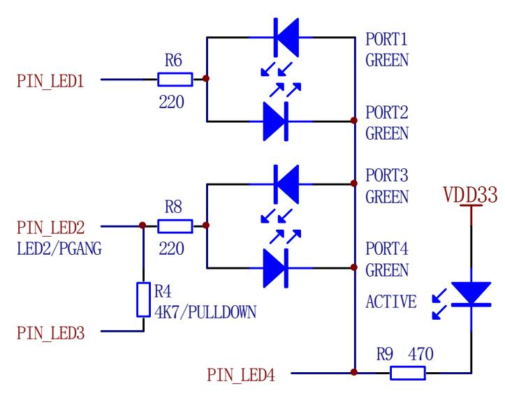

图 3-3-2 CH335 启用 PGANG 配置的 5 灯应用示意图

#### 3.3.3 CH334U/F 的 5 灯应用

对于 CH334U 和 CH334F,有独立的 PSELF 引脚可以用于配置,并且不支持独立过流检测、不需要 PGANG 配置选择,所以,引脚 LED1 和 LED2 无需复用于配置 PSELF 和 PGANG。

CH334U/CH334F 的 5 灯应用如图 3-3-3 所示,注意 LED 与端口对应关系(可定制)。各端口对应的绿灯亮起表明端口状态正常,绿灯熄灭表明端口无设备或挂起 Suspend。所有 LED 是可选的。

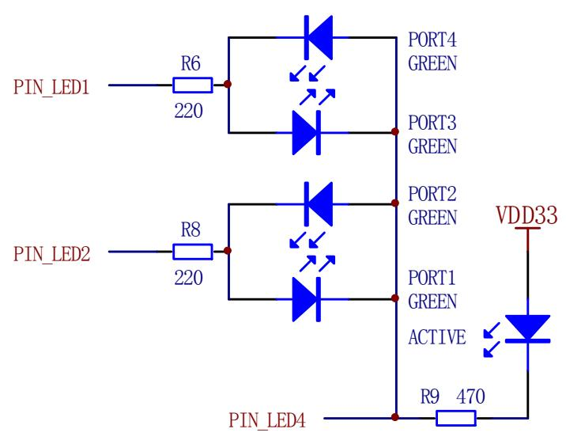

图 3-3-3 CH334U/F 的 5 灯应用示意图

#### 3.3.4 CH335 全 9 灯应用

9 灯应用主要用于 CH335,如图 3-3-4 所示。9 灯应用相比 5 灯应用增加了 4 个 LED 红灯,端口对应的红灯亮起表明端口异常,包括端口过流或者传输错误等。

CH335 的 LED3 引脚兼用于 MCU 控制上行端口与 1#下行端口交换,属于默认关闭的可配置功能, 配置使能后将只支持 5 灯应用。LED3 默认配置为 9 灯应用,可在订购时确认。

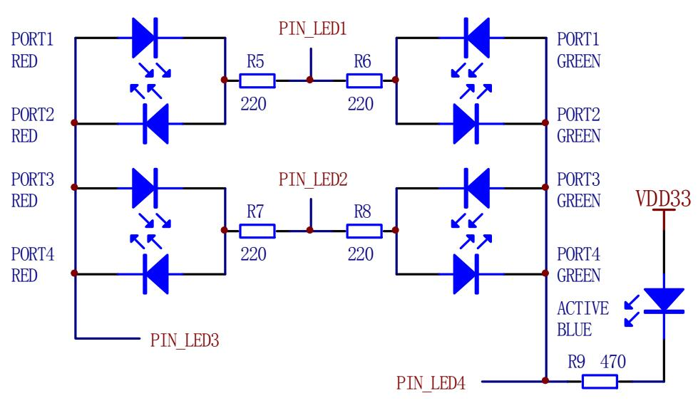

图 3-3-4 LED 指示灯 9 灯应用示意图

#### 3.3.5 PGANG 引脚 LED

部分封装形式提供 PGANG 引脚或 PSELF 引脚,PSELF 为内置上拉电阻的输入引脚,用于配置供电模式。PGANG 是双向引脚,内置上拉电阻,在复位期间配置电源过流保护模式,在复位完成后转为睡眠 Suspend、正常 Active 状态输出。PGANG 引脚驱动的 LED 等效于 LED4 引脚驱动的 1 灯应用,区别在于 LED4 引脚是动态分时驱动 LED, PGANG 引脚是静态驱动,LED 限流电阻 R9 可以大些。

如图 3-3-5 左图,PGANG 引脚默认被内置电阻上拉,默认高电平,选择整体过流检测和整体电源控制。PGANG 引脚输出低电平、LED 亮表示 Active,LED 灭表示 Suspend。

如图 3-3-5 右图,PGANG 引脚被外部电阻 R4 下拉,默认低电平,选择独立过流检测。PGANG 引脚内部反相输出,PGANG 引脚输出高电平、LED 亮表示 Active, LED 灭表示 Suspend。

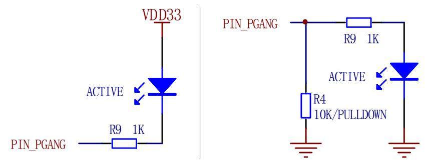

图 3-3-5 PGANG 引脚驱动 LED 示意图,右图为启用 PGANG 配置

静态驱动的 PGANG 引脚可以用于控制外部设备的电源,例如在 Suspend 时关闭外设电源。

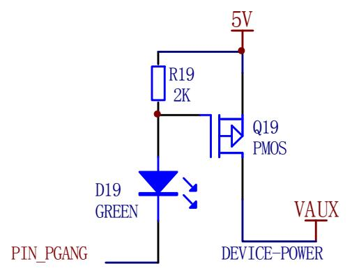

图 3-3-6 PGANG 引脚控制外部设备电源示意图

## 3.4 EEPROM 配置接口

CH334 和 CH335 提供两线 I2C 接口与外部 EEPROM 存储芯片通信,EEPROM 芯片地址为 0,EEPROM 中存储有自定义的厂商 ID、产品 ID、配置等信息。SCL 引脚输出时钟频率为 187. 5KHz,SDA 引脚已内置约 250uA 上拉电流以支持开漏双向数据通讯,无需外部上拉电阻。参考图 3-4,连接外部 EEPROM 与 LED 驱动没有冲突,支持 9 灯、5 灯、1 灯、无 LED 灯应用。

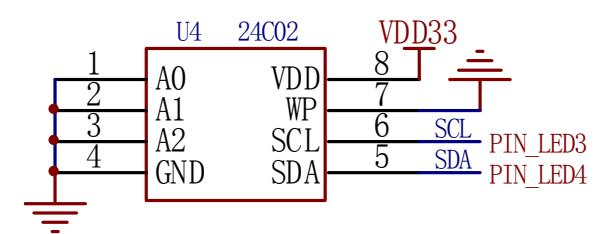

图 3-4 外部 EEPROM 连接示意图

CH334 和 CH335 内置信息存储器,针对行业特殊需求可以代替外部 EEPROM 批量定制厂商或产品信息及配置,例如设置下行端口个数,设置下行端口的设备不可移除特性等。

# 3.5 EEPROM 内容

CH334/CH335 支持从外部 EEPROM 中加载厂商识别码 VID、产品识别码 PID 等配置信息,芯片上电后首先加载内部信息存储器的数据,加载完内部数据后加载外部 EEPROM 的数据。如果 EEPROM 中数据的校验和 CHKSUM 无效,则放弃 EEPROM 中所有数据;如果 EEPROM 的 CHKSUM 有效,则加载 EEPROM 中所有数据。EEPROM 具体布局如表 3-5-1 所示,EEPROM 中各地址定义说明如表 3-5-2 所示。

00 01 02 03 04 05 06 07 80 09 0B OC. OD OE 0F 0A Max Device Port 00h VID L VID H PID L PID H CHKSUM FF SIG CFG FF FF FF FF FF Removable Number Power

表 3-5-1 EEPROM 地址布局

| 10h-2Fh | Reserved                      |                                |               |  |  |  |
|---------|-------------------------------|--------------------------------|---------------|--|--|--|
| 30h     |                               | Reserved                       | Prod Len+2 |  |  |  |
| 40h     | Prod Product String (UNICODE) |                                |               |  |  |  |
| 50h     | Len                           |                                |               |  |  |  |
| 60h     |                               | Product String End             | SN Len+2   |  |  |  |
| 70h     | SN Len                     | Serial Number String (UNICODE) |               |  |  |  |
| 80h-9Fh |                               | Serial Number Strin            | ng End        |  |  |  |
| A0h-FFh |                               | Reserved                       |               |  |  |  |

## 表 3-5-2 EEPROM 地址内容定义

| 字节地址 | 参数简称                | 参数说明                                       | 默认值  |  |  |
|------|---------------------|--------------------------------------------|------|--|--|
| 00h  | VID_L               | 厂商识别码 VID 的低字节。                            | 86h  |  |  |
| 01h  | VID_H               | 厂商识别码 VID 的高字节。                            |      |  |  |
| 02h  | PID_L               | 产品识别码 PID 的低字节。                            | 随型号  |  |  |
| 03h  | PID_H               | 产品识别码 PID 的高字节。                            |      |  |  |
| 046  | CHKSUM              | 校验和 CHKSUM 必须等于 VID_H+VID_L+PID_L+PID_H+1, |      |  |  |
| 04h  |                     | 否则忽略 EEPROM 的所有数据。                         |      |  |  |
|      | Device Removable | Bit7~Bit5,Bit0:保留 reserved。                |      |  |  |
|      |                     | Bit4: 为 1 表示连接至下行端口 4 的设备不可移除。             |      |  |  |
| 06h  |                     | Bit3: 为 1 表示连接至下行端口 3 的设备不可移除。             | 00h  |  |  |
|      |                     | Bit2: 为 1 表示连接至下行端口 2 的设备不可移除。             |      |  |  |
|      |                     | Bit1: 为 1 表示连接至下行端口 1 的设备不可移除。             |      |  |  |
| 07h  | Port Number         | 下行端口个数,有效值范围 1~4。                          |      |  |  |
| 08h  | Max Power           | 最大工作电流,单位为 2mA。                            | 32h  |  |  |
| 09h  | SIG                 | OAh 信息 CFG 有效的签名标志,必须是 5Ah,否则 CFG 无效。      | 5Ah  |  |  |
|      | CFG                 | Bit7: 保留 reserved。                         |      |  |  |
| 0Ah  |                     | Bit6: EEPROM 写允许,0=写保护,1=允许被 USB 工具改写。     | 57h  |  |  |
|      |                     | Bit5: 过流检测电压阈值 OC_LEVEL 选择,                | 3711 |  |  |
|      |                     | 默认 0=2. 4V 且弱上拉,1=4. 1V 且弱下拉。              |      |  |  |

当用 PMOS 简化电源控制时可选 4. 1V,否则用 2. 4V。
Bit4: 保留 reserved,必须为 1。
Bit3: 保留 reserved,必须为 0。
Bit2: 配置供电模式 SELF\_POWER,

默认 1=自供电(建议),0=总线供电。
EEPROM 配置 0 与引脚 PSELF 设置低电平等效。
Bit1: 指示灯使能 INDICATOR\_EN,默认 0,1=使能指示灯。
Bit0: 配置电源过流保护模式 GANG\_MODE,

默认 1=整体联动过流检测,0=独立过流检测。
EEPROM 配置 0 与引脚 PGANG 或 LED2 外置下拉等效。

## 3.6 总线供电与自供电

CH334/CH335 支持 USB 总线供电和 HUB 自供电。总线供电来自 USB 上行端口,供电能力为 500mA 或 900mA、1. 5A 等多种标准,USB 线材内阻损耗和 HUB 自身消耗会降低对下行端口的供电能力,下行端口电压可能偏低。自供电通常来自外部电源端口,取决于外部电源供电能力。

由于自供电与总线供电的电压难以完全相等,所以 HUB 需要避免两者直接短接而产生大电流。另外,当 USB 上行端口断电后,HUB 也要避免自供电的外部电源向 USB 总线及 USB 主机倒灌电流。

#### 3.6.1 双向隔离示意

二极管 D1 和 D2 用于双向隔离 VBUS 总线电源和 P6 端口外部供电,防止两个电源相互倒灌,采用大功率的肖特基二极管以降低自身压降,下行端口 VBUS 得到 4.7V 电压甚至更低,仅为示意。

可选的,分压电阻 R31 和 R32 用于实现总线供电和自供电两种模式的自动配置。

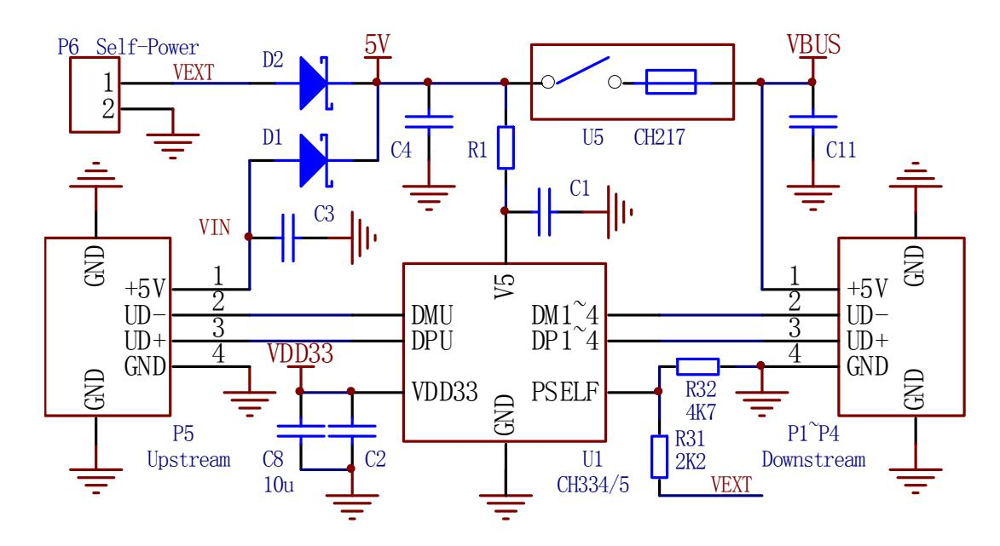

#### 图 3-6-1 肖特基二极管双向隔离 VBUS 和外部供电的示意图

### 3.6.2 实用的单隔离方案

理想二极管的功能是低压降单向导通,U3 用于防止 P6 端口的外部电源向上行端口 VBUS 倒灌,在 500mA 电流时,U3 的压降约为肖特基二极管压降的三分之一,下行端口 VBUS 可以得到 4. 9V 电压。

可选的, 图中 CH334/5 的 V5 电源跳过 U3 由上行端口 VBUS 直接提供。这种情况下, 即使没有 USB 限流配电开关 CH217, U3 也能为上行端口 VBUS 电源提供简单的过流和短路保护。

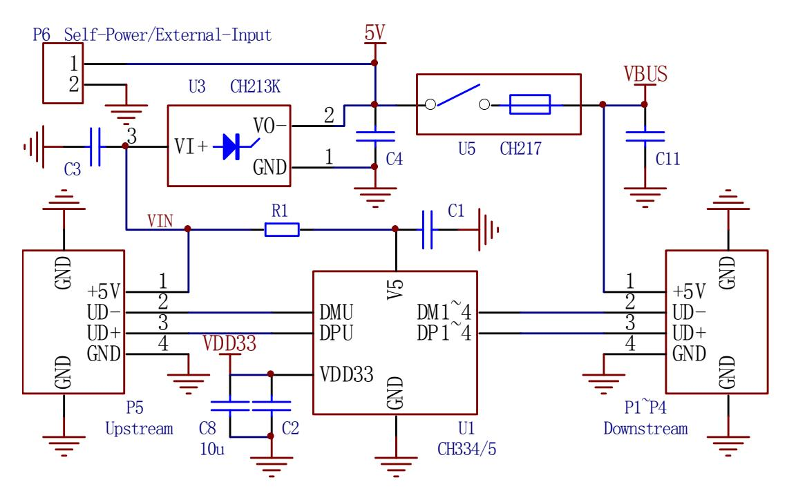

图 3-6-2 理想二极管隔离 VBUS 和外部供电的示意图

# 第4章 参数

# 4.1 绝对最大值(临界或者超过绝对最大值将可能导致芯片工作不正常甚至损坏)

| 名称    | 参数说明                          | 最小值                           | 最大值        | 单位            |
|-------|-------------------------------|-------------------------------|------------|---------------|
| TA    | 工作时的环境温度                      | -40                           | 85         | ${\mathbb C}$ |
| TS    | 储存时的环境温度                      | -55                           | 150        | $^{\circ}$    |
| V5    | LDO 输入电源电压(V5 引脚接电源,GND 引脚接地) | -0. 4                         | 5. 5       | ٧             |
| VDD33 | 工作电源电压(VDD33 引脚接电源,GND 引脚接地)  | -0. 4                         | 4. 0       | ٧             |
| V51   | 5V 耐压输入引脚上的电压                 | -0. 4                         | 5. 3       | ٧             |
| VUSB  | USB 信号引脚上的电压                  | -0. 4                         | VDD33+0. 4 | ٧             |
| VGP10 | 其它(3.3V)输入或者输出引脚上的电压          | -0. 4                         | VDD33+0. 4 | ٧             |
| VESD  | USB 信号引脚上的 HBM 人体模型 ESD 耐压    | USB 信号引脚上的 HBM 人体模型 ESD 耐压 6K |            | ٧             |

# **4.2 电气参数** (测试条件: TA=25℃, V5=5V 或 V5=VDD33=3.3V)

| 名称     |                       | 参数说明     |              | 最小值  | 典型值   | 最大值   | 单位 |
|--------|-----------------------|----------|--------------|------|-------|-------|----|
| V5     | LDO 输入电               | □源电压@V5  | 启用内部 LD0     | 4. 5 | 5. 0  | 5. 25 | V  |
|        | 外供电源                  | 原电压@V5   | 无需内部 LD0     | 3. 2 | 3. 3  | 3. 4  |    |
| VDD33  | LDO 输出F               | 电压@VDD33 | 启用内部 LD0     | 3. 2 | 3. 3  | 3. 5  | V  |
|        | 外供 3. 3V              | 电压@VDD33 | 无需内部 LD0     | 3. 2 | 3. 3  | 3. 4  |    |
| ILD0   | 内部电源调节器 LDO 对外负载能力    |          |              |      |       | 20    | mA |
|        | 工作电流                  | 上行高速     | 4 个下行高速      |      | 85    |       | mA |
| ICC    |                       | 上行高速     | 1 个下行高速      |      | 42    |       | mA |
|        |                       | 上行高速     | 4 个下行全速      |      | 25    |       | mA |
|        |                       | 上行高速     | 1 个下行全速      |      | 21    |       | mA |
|        |                       | 上行全速     | 4 个下行全速      |      | 20    |       | mA |
|        |                       | 上行高速     | 下行无设备        |      | 0. 3  |       | mA |
|        |                       | 上行全速     | 含 1. 5K Ω 上拉 |      |       |       |    |
| ISLP   | 深度睡眠电源电流(不含 1.5KΩ上拉)  |          |              |      | 0. 12 | 0. 4  | A  |
| ISLP   | 或: 自身睡                | 眠电源电流(   | 不接 USB 主机)   |      | 0.12  | U. 4  | mA |
| VIL    | 除过流检测外引脚的低电平输入电压      |          |              | 0    |       | 0. 8  | ٧  |
| VIH    | 除过流检测外引脚的高电平输入电压      |          |              | 2. 0 |       | VDD33 | ٧  |
| VILRST | RESET#引脚的低电平输入电压      |          |              | 0    |       | 0. 75 | ٧  |
| VIX    | 过流检测电压阈值 0C_LEVEL 的误差 |          |              |      | ±0.2  |       | ٧  |

|       | 低电平  | LED 引脚,吸入 吸入 15mA 电流                   |           | 0.5       | 0.6 | V  |
|-------|------|----------------------------------------------------|-----------|-----------|-----|----|
| VOL   | 输出电压 | PWREN#引脚, ,吸入 4mA 电流                      |           | 0.5       | 0.6 | V  |
| VOH   | 高电平  | LED 引脚,输出 输出 10mA 电流                   | VDD33-0.6 | VDD33-0.5 |     | V  |
|       | 输出电压 | PWREN#引脚, ,输出 1mA 电流                      | VDD33-0.6 | VDD33-0.5 | 4.3 | V  |
| IPU   | 上拉电流 | LED1/2/3/PSELF/PGANG LED1/2/3/PSELF/PGANG 引脚 | 16        | 40        | 80  | uA |
| IPUOC | 上拉电流 | OVCUR# OVCUR#引脚                                 | 8         | 14        | 24  | uA |
| IPDOC | 下拉电流 | OVCUR# OVCUR#引脚                                 | 2         | 5         | 40  | uA |
| Vlvr  |      | 电源低压复位的电压门限                                        | 2.5       | 2.9       | 3.2 | V  |

# 第5章 封装

说明:尺寸标注的单位是 mm (毫米)。

引脚中心间距是标称值,没有误差,除此之外的尺寸误差不大于±0.2mm。

## 5.1 QFN16\_3x3

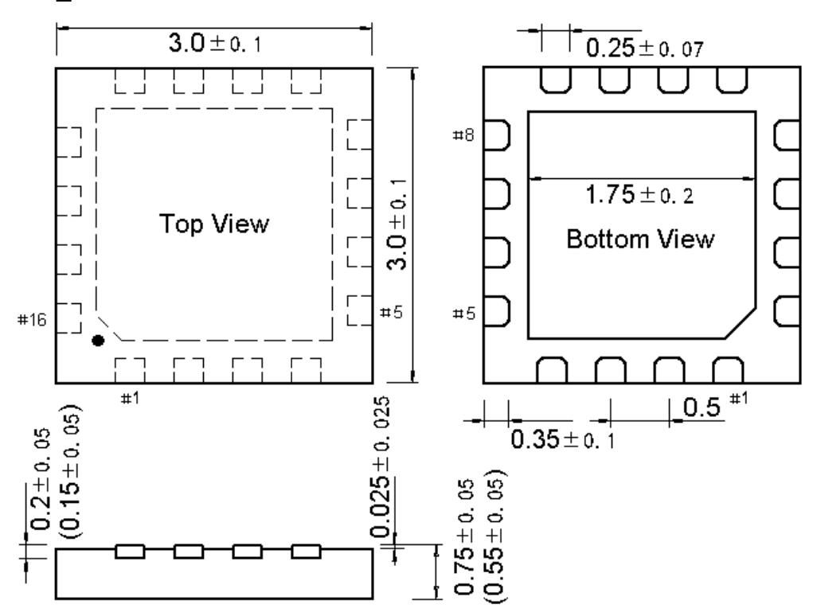

## 5. 2 QFN12\_2x2

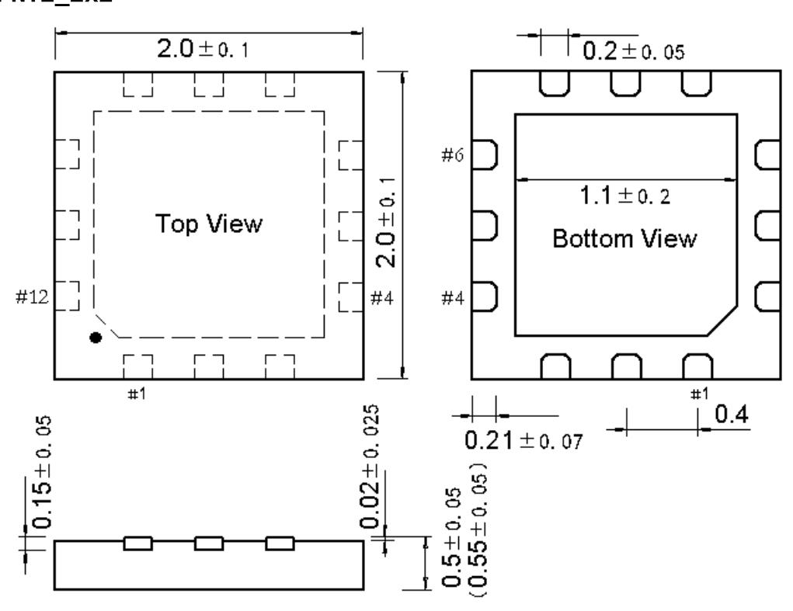

## **5.3 QSOP16**

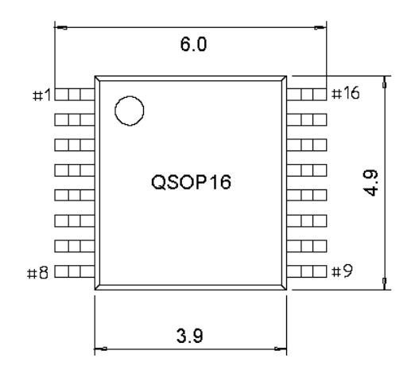

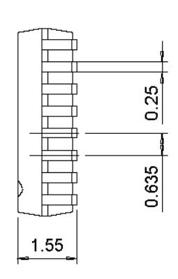

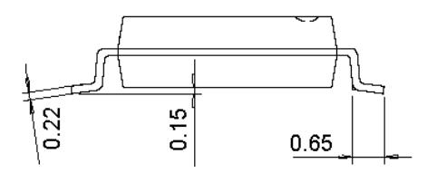

### **5.4 QSOP28**

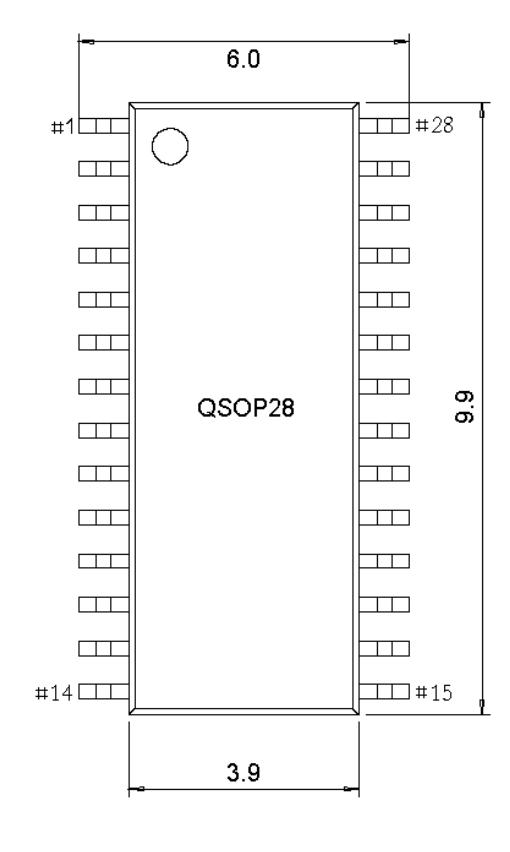

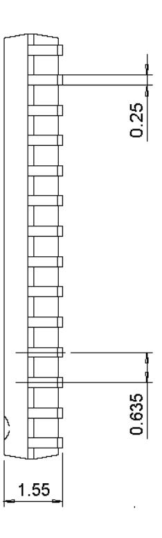

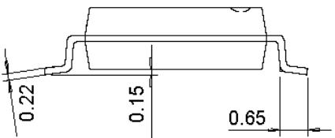

## **5.5 QFN24\_4x4**

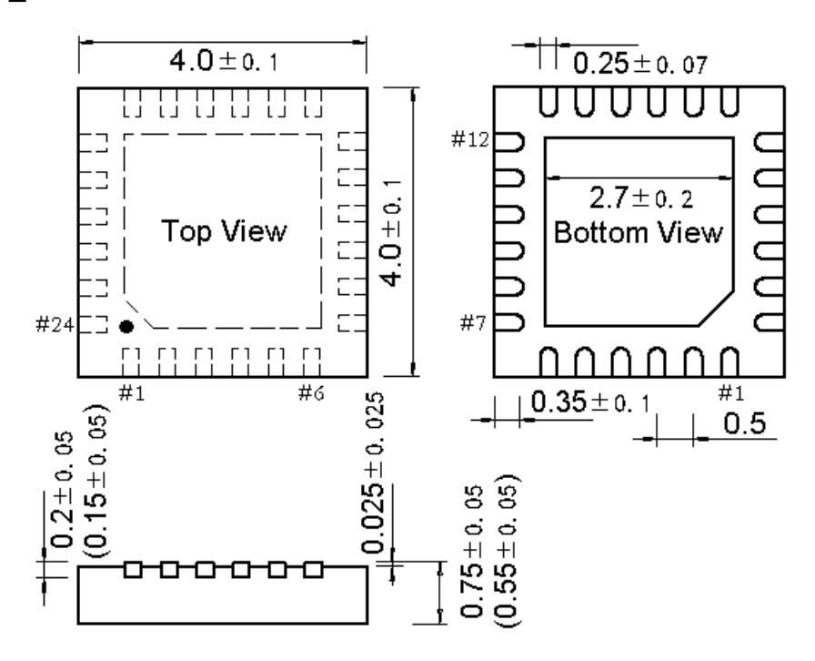

### **5.6 QFN28\_4x4**

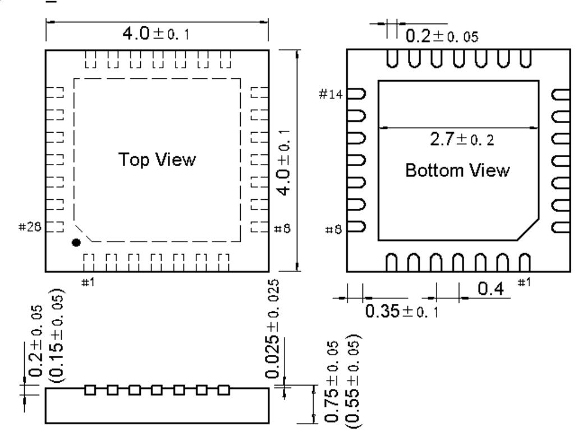

### **5.7 QFN28\_5x5**

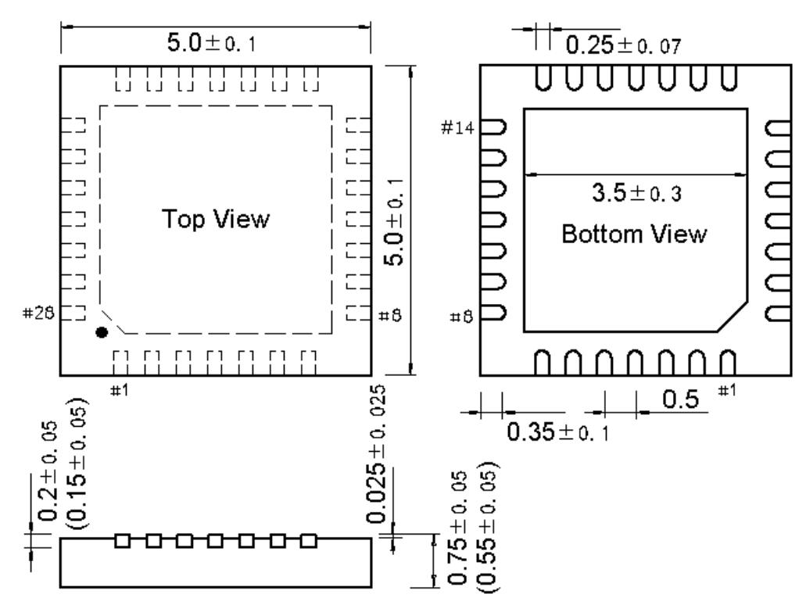

### **5.8 SSOP28**

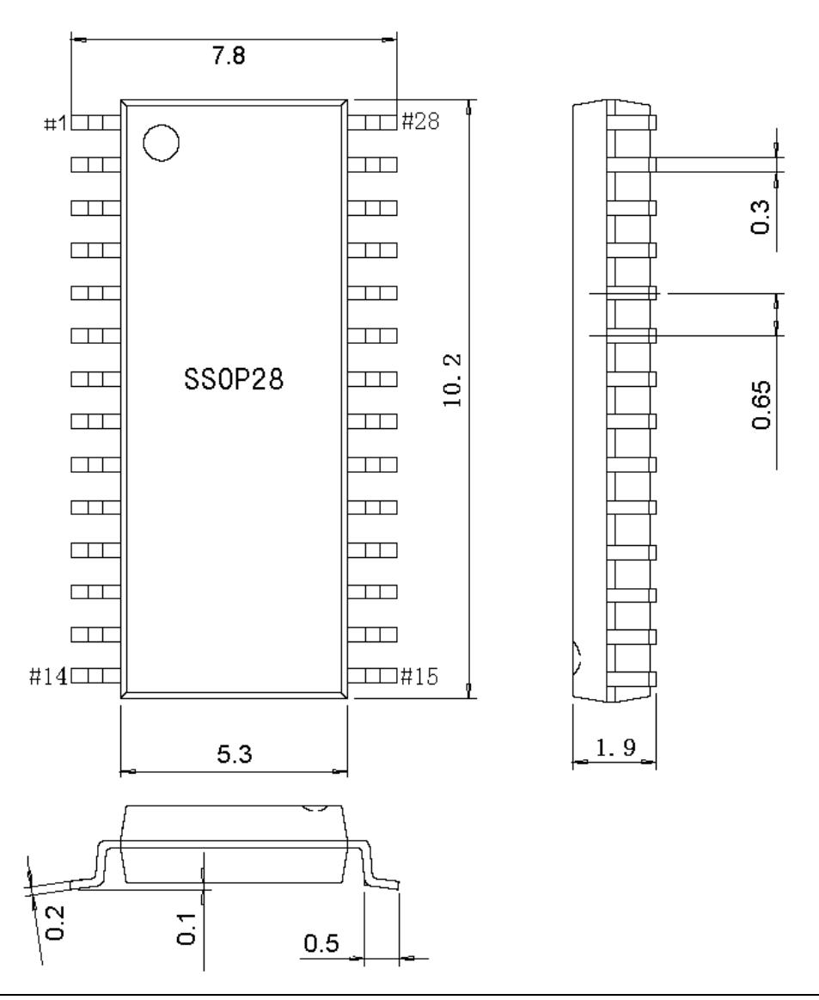

## **5.9 QFN36\_6x6**

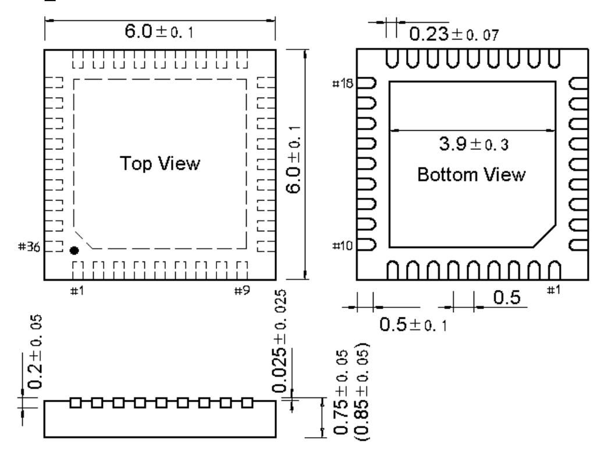

### **5.10 LQFP48**

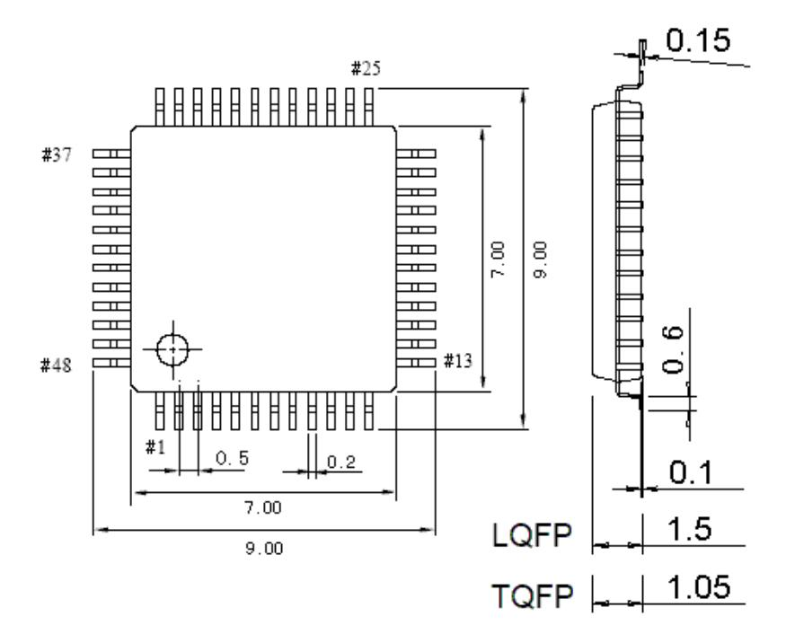

# 第6章 应用

## 6.1 简化应用,总线供电

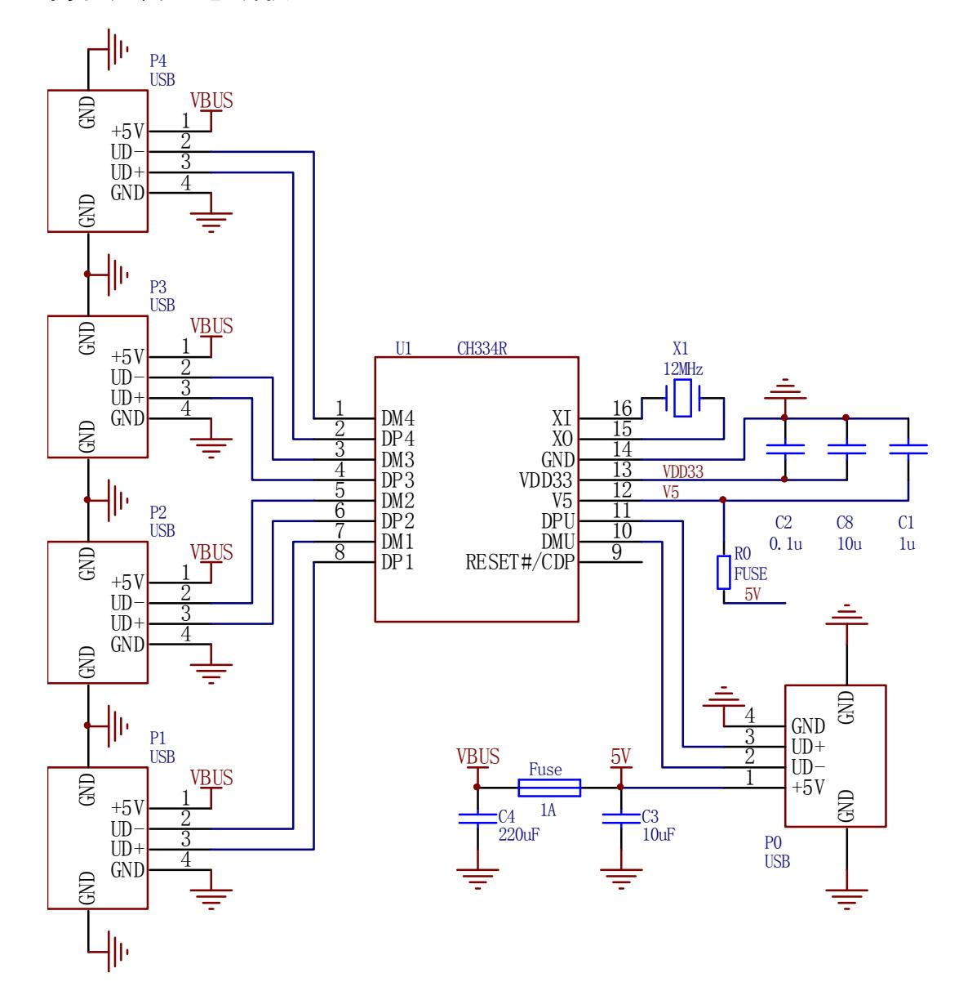

R0 为 100mA 保险电阻,简化应用中,可以用 0 Ω。如有过压保护器件,则连接在 V5 引脚。 5V 与 VBUS 之间的保险电阻 Fuse 可以改用 USB 限流电源开关芯片,保护响应更快,效果更好。

工业级应用建议将 V5 和 VDD33 都接到外供的 3. 3V 电源,使 HUB 芯片的最大功耗从 85mA\*5V 降低到 85mA\*3. 3V,有利于减小 HUB 芯片的压降和温升。实测可支持扩展工业级温度范围 $-40\,^{\circ}$  $\sim$ 105 $^{\circ}$  $\sim$ 105 $^{\circ}$  $\sim$ 1105 $^{\circ}$  $\sim$ 1105 $^{\circ}$  $\sim$ 1105 $^{\circ}$  $\sim$ 1105 $^{\circ}$  $\sim$ 1105 $^{\circ}$  $\sim$ 1105 $^{\circ}$  $\sim$ 1105 $^{\circ}$  $\sim$ 1105 $^{\circ}$  $\sim$ 1105 $^{\circ}$  $\sim$ 1105 $^{\circ}$  $\sim$ 1105 $^{\circ}$  $\sim$ 1105 $^{\circ}$  $\sim$ 1105 $^{\circ}$  $\sim$ 1105 $^{\circ}$  $\sim$ 1105 $^{\circ}$  $\sim$ 1105 $^{\circ}$  $\sim$ 1105 $^{\circ}$  $\sim$ 1105 $^{\circ}$  $\sim$ 1105 $^{\circ}$  $\sim$ 1105 $^{\circ}$  $\sim$ 1105 $^{\circ}$  $\sim$ 1105 $^{\circ}$  $\sim$ 1105 $^{\circ}$  $\sim$ 1105 $^{\circ}$  $\sim$ 1105 $^{\circ}$  $\sim$ 1105 $^{\circ}$  $\sim$ 1105 $^{\circ}$  $\sim$ 1105 $^{\circ}$  $\sim$ 1105 $^{\circ}$  $\sim$ 1105 $^{\circ}$  $\sim$ 1105 $^{\circ}$  $\sim$ 1105 $^{\circ}$  $\sim$ 1105 $^{\circ}$  $\sim$ 1105 $^{\circ}$  $\sim$ 1105 $^{\circ}$  $\sim$ 1105 $^{\circ}$  $\sim$ 1105 $^{\circ}$  $\sim$ 1105 $^{\circ}$  $\sim$ 1105 $^{\circ}$  $\sim$ 1105 $^{\circ}$  $\sim$ 1105 $^{\circ}$  $\sim$ 1105 $^{\circ}$  $\sim$ 1105 $^{\circ}$  $\sim$ 1105 $^{\circ}$  $\sim$ 1105 $^{\circ}$  $\sim$ 1105 $^{\circ}$  $\sim$ 1105 $^{\circ}$  $\sim$ 1105 $^{\circ}$  $\sim$ 1105 $^{\circ}$  $\sim$ 1105 $^{\circ}$  $\sim$ 1105 $^{\circ}$  $\sim$ 1105 $^{\circ}$  $\sim$ 1105 $^{\circ}$  $\sim$ 1105 $^{\circ}$  $\sim$ 1105 $^{\circ}$  $\sim$ 1105 $^{\circ}$  $\sim$ 1105 $^{\circ}$  $\sim$ 1105 $^{\circ}$  $\sim$ 1105 $^{\circ}$  $\sim$ 1105 $^{\circ}$  $\sim$ 1105 $^{\circ}$  $\sim$ 1105 $^{\circ}$  $\sim$ 1105 $^{\circ}$  $\sim$ 1105 $^{\circ}$  $\sim$ 1105 $^{\circ}$  $\sim$ 1105 $^{\circ}$  $\sim$ 1105 $^{\circ}$  $\sim$ 1105 $^{\circ}$  $\sim$ 1105 $^{\circ}$  $\sim$ 1105 $^{\circ}$  $\sim$ 1105 $^{\circ}$  $\sim$ 1105 $^{\circ}$  $\sim$ 1105 $^{\circ}$  $\sim$ 1105 $^{\circ}$  $\sim$ 1105 $^{\circ}$  $\sim$ 1105 $^{\circ}$  $\sim$ 1105 $^{\circ}$  $\sim$ 1105 $^{\circ}$  $\sim$ 1105 $^{\circ}$  $\sim$ 1105 $^{\circ}$  $\sim$ 1105 $^{\circ}$  $\sim$ 1105 $^{\circ}$  $\sim$ 1105 $^{\circ}$  $\sim$ 1105 $^{\circ}$  $\sim$ 1105 $^{\circ}$  $\sim$ 1105 $^{\circ}$  $\sim$ 1105 $^{\circ}$  $\sim$ 1105 $^{\circ}$  $\sim$ 1105 $^{\circ}$  $\sim$ 1105 $^{\circ}$  $\sim$ 1105 $^{\circ}$  $\sim$ 1105 $^{\circ}$  $\sim$ 1105 $^{\circ}$  $\sim$ 1105 $^{\circ}$  $\sim$ 1105 $^{\circ}$  $\sim$ 1105 $^{\circ}$  $\sim$ 1105 $^{\circ}$  $\sim$ 1105 $^{\circ}$  $\sim$ 1105 $^{\circ}$  $\sim$ 1105 $^{\circ}$  $\sim$ 1105 $^{\circ}$  $\sim$ 1105 $^{\circ}$  $\sim$ 1105 $^{\circ}$  $\sim$ 1105 $^{\circ}$  $\sim$ 1105 $^{\circ}$  $\sim$ 1105 $^{\circ}$  $\sim$ 1105 $^{\circ}$  $\sim$ 1105 $^{\circ}$  $\sim$ 1105 $^{\circ}$  $\sim$ 1105 $^{\circ}$  $\sim$ 1105 $^{\circ}$  $\sim$ 1105 $^{\circ}$  $\sim$ 1105 $^{\circ}$  $\sim$ 1105 $^{\circ}$  $\sim$ 1105 $^{\circ}$  $\sim$ 1105 $^{\circ}$  $\sim$ 1105 $^{\circ}$  $\sim$ 1105 $^{\circ}$  $\sim$ 1105 $^{\circ}$  $\sim$ 1105 $^{\circ}$  $\sim$ 1105 $^{\circ}$  $\sim$ 1105 $^{\circ}$  $\sim$ 1105 $^{\circ}$  $\sim$ 1105 $^{\circ}$  $\sim$ 1105 $^{\circ}$  $\sim$ 1105 $^{\circ}$  $\sim$ 1105 $^{\circ}$  $\sim$ 1105 $^{\circ}$  $\sim$ 1105 $^{\circ}$  $\sim$ 1105 $^{\circ}$  $\sim$ 1105 $^{\circ}$  $\sim$ 1105 $^{\circ}$  $\sim$ 1105 $^{\circ}$  $\sim$ 1105 $^{\circ}$  $\sim$ 1105 $^{\circ}$  $\sim$ 1105 $^{\circ}$  $\sim$ 1105 $^{\circ}$  $\sim$ 1105 $^{\circ}$  $\sim$ 1105 $^{\circ}$  $\sim$ 1105 $^{\circ}$  $\sim$ 1105 $^{\circ}$  $\sim$ 1105 $^{\circ}$  $\sim$ 1105 $^{\circ}$  $\sim$ 1105 $^{\circ}$  $\sim$ 1105 $^{\circ}$  $\sim$ 1105 $^{\circ}$  $\sim$ 11

CH334Q 没有内部 LDO 降压调节器和 V5 引脚, 所有 VDD33 都需要接到外供的 3.3V 电源。

在下行端口 USB 设备带电热插拔的瞬间,动态负载可能使 VBUS 和 5V 电压瞬时跌落,进而可能产生 LVR 低压复位,从而出现整个 HUB 断开再连接的现象。改进方法:①在规范允许范围内加大 5V 电源的电解电容(加大图示 C4 容量),缓解跌落;②加大 HUB 芯片 LDO 输出端的电容(加大图示 C8 容量,例如 22uF);③不用 HUB 内部 LDO,而是外供 3. 3V 到 V5 和 VDD33 引脚,并且加大 3. 3V 电源的

电容: ④增强 5V 供电能力或改为自供电,另外,提升 USB 线材质量也会改善供电能力。

## 6.2 免晶振应用,总线供电

CH334 和 CH335 内置了专业的高精度时钟,可以去掉外部 12MHz 晶体,减小整机体积并降低 EMI 和成本,可能部分指标在有些环境下会偏离 USB 规范,适用于非精密场合。

免晶振属于可配置功能,CH335J 默认开启,其它 CH335 和 CH334 可在订购时确认。应用时 X0 引脚悬空且 XI 引脚接 GND 选择免晶振,否则 XI 与 XO 需连接晶体。

U3 是低压降理想二极管 CH213,具有简单的过流和短路保护功能,且保护响应更快,从而可以替代并省掉前面 6.1 节中 5V 与 VBUS 之间的保险电阻 Fuse。

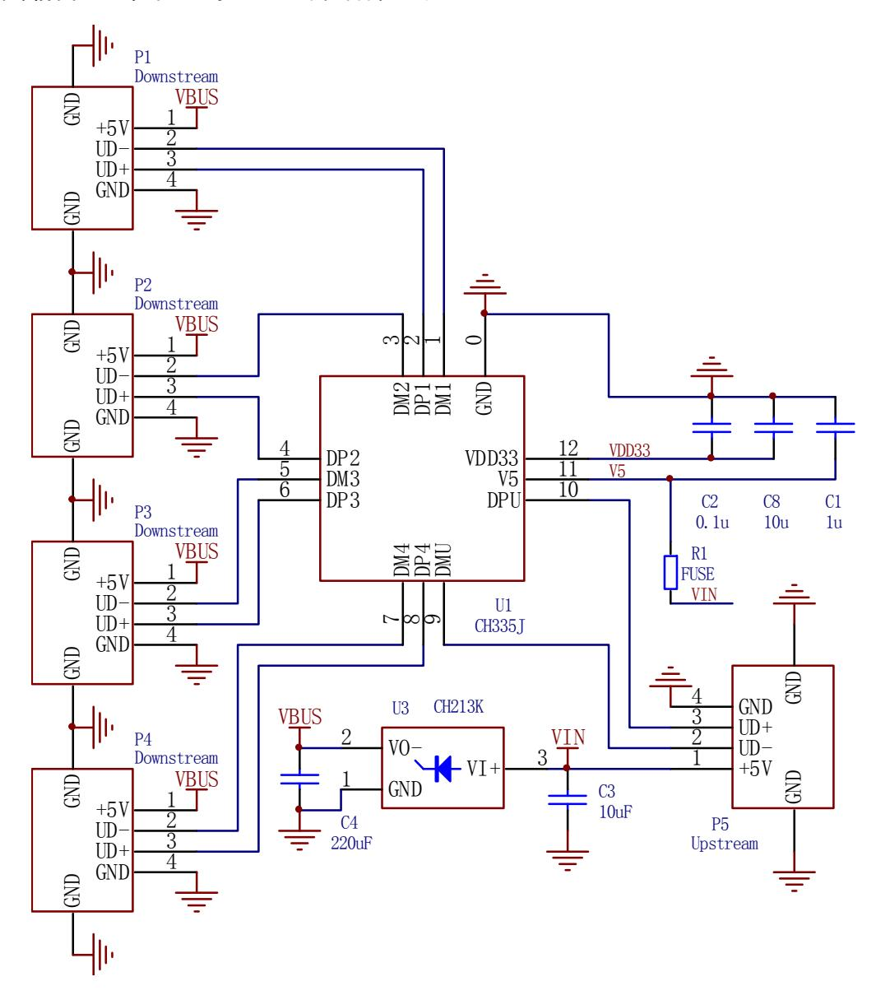

# 6.3 简化应用,可外部供电

与前面 6.1 节中的电路的主要区别在于具有外部供电端口 P6, U3 是低压降理想二极管 CH213,

用于避免 P6 外部电源向上行端口 P5 的 VBUS 倒灌,尤其是上行端口例如计算机关机而 P6 外部仍然供电时的情况。理论上 U3 可以换成肖特基二极管,但需要选择自身压降较低的器件,否则会降低下行端口 VBUS 的输出电压,在 300mA 负载电流时,肖特基二极管的压降约 0.3V,理想二极管的压降约 0.05V。

由于 P6 自身及外部电源通常没有负载,所以一般不考虑 P5 向 P6 的倒灌。

低压降二极管 CH213 具有简单的过流和短路保护功能,且保护响应更快,从而可以替代并省掉前面 6.1 节中 5V 与 VBUS 之间的保险电阻 Fuse。P6 所接的外部电源自身需要有过流和短路保护能力,否则,需要在 P6 与 5V 之间加上保险电阻,或者在 5V 与 VBUS 之间加上 USB 限流电源开关芯片。

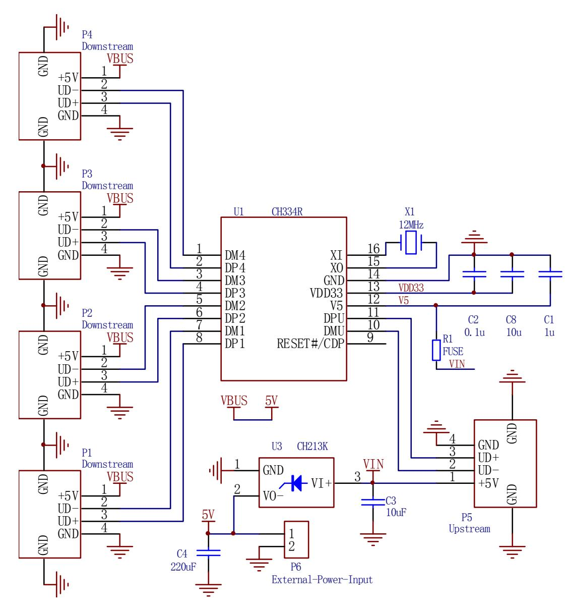

# 6.4 板载嵌入 HUB

如果有板载 3.3V 电源,那么建议将 HUB 芯片的 V5 和 VDD33 都接 3.3V 电源。这种情况下,C8 和C2 也可以合并为单个 1uF 电容(可选)。

如果 USB 设备也是固定板载,那么还可以设置对应的下行端口的 USB 设备为不可移除,并且可以

简化 VBUS 电源控制、将 5V 直供 USB 设备、简化或取消过流检测等。

## 6.5 独立过流检测应用

下图为 HUB 各端口独立电源配电控制、独立过流检测的应用参考图,可以用于计算机和 HUB 集线器。图中 R21~R24 根据电源供电能力设置限流门限,CH217 的 FLAG#引脚可以产生过流或过温报警信号通知 HUB 控制器及计算机,CH334/5 的 OVCUR#引脚已内置上拉电阻(默认 OC LEVEL=0)。

P6 为外部自供电输入端口,理想二极管 U3 用于避免外部供电向上行端口 USB 电源的倒灌。如果没有 P6 或者不考虑防倒灌,那么无需 U3,VIN 与+5V 之间可以短接。

设计 PCB 时需考虑实际工作电流承载能力,VIN、+5V、VOUT(VBUS\*)和 P6 及各端口 GND 走线路径的 PCB 尽可能宽,如有过孔则建议多个并联。

建议 VIN 加过压保护器件,建议所有 USB 信号加 ESD 保护器件,例如 CH412K,其 VCC 应接 3V3。

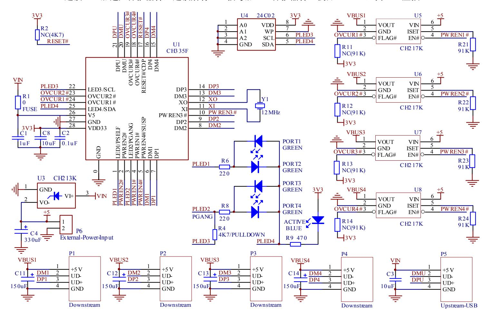

# 6.6 整体过流检测应用

下图为 HUB 所有端口 GANG 电源配电控制和整体过流检测的应用参考图,CH217 是支持过流保护的 USB 配电开关芯片。

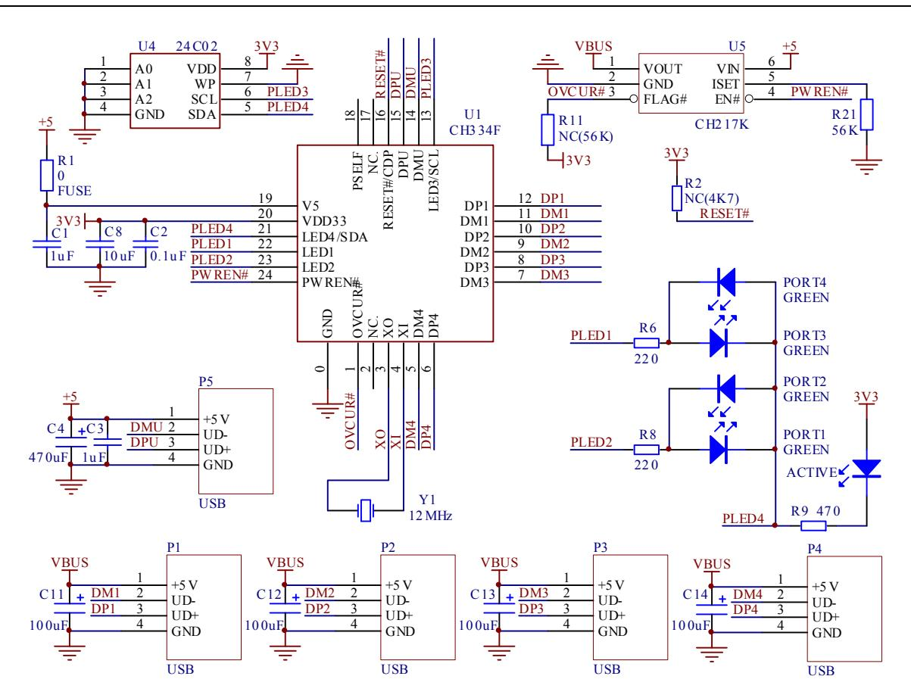